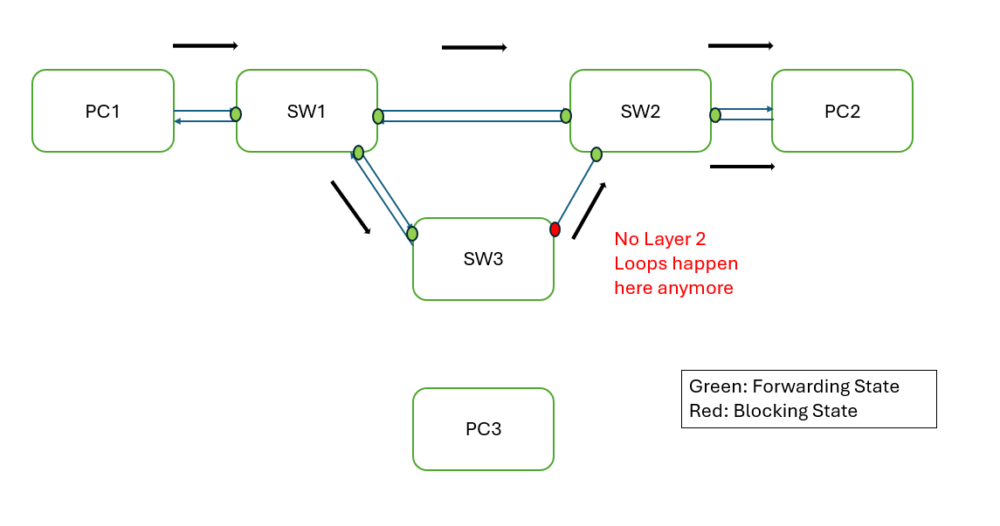
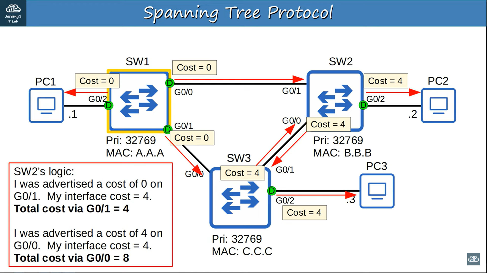

### Broadcast Storms
- imagine three switches connect to each other
- broadcast frames is sent from one pc
- even the target PC send the arp reply, the broadcast frames still remain in other connection
- thus process repeated forever

<br>


### MAC Address Flapping
- each time a frame arrives on a switchport, switch learn the MAC address and update MAC Address table
- switch continously update MAC address table when same source MAC address arrive on different interface

<br>
<hr>
<br>

### Spanning Tree Protocol (STP)
- _**Classic**_ Spanning Tree Protocol - 802.1D
- place redundant ports in blocking state to disable the interface (prevent layer 2 loops)
- forwarding -> blocking state when active interface fails
    - forwarding state: send and receive **ALL** normal traffic
    - blocking state: send and receive **STP** messages / BPDUs (Bridge Protocol Data Units)
- switches send/receive Hello BPDUs out of all interfaces every 2 seconds to know which interface is connected to another switches

<br>



<br>

- Bridge ID (a field in BPDU) determine root bridge/switch in the network
    - lowest Bridge ID  = highest priority -> root bridge
    - all ports on root bridge are put in a forwarding state
    - other switches must have path to reach the root bridge
    - Cisco switches use PVST/PVST+ (Per-VLAN Spanning Tree) - each VLAN different interfaces can be forwarding/blocking
        - PVST support ISL trunk encapsulation
            - dest MAC: 0180.c200.0000
        - PVST+ support 802.1Q encapsulation
            - dest IPV6: 01:00:0c:cc:cc:cd
            - dest MAC: 0100.0ccc.cccd
        - different VLAN has different priority
        - e.g. VLAN1 is forwarding but VLAN2 is blocking
- every switches think itself is root bridge at first, so they will all send BPDU
- switches will only give up the position if it receives BPDU from lower bridge ID
- once all switches agree on the root bridge, only root bridge sends BPDUs
- other switches not generate but forward these BPDUs

```
         _ _ _ _ _ _ _ _ _ _ _ _ _ _ _ _ _ _ _ _ _ _ _ _ _ _ 
        |                           |                       |
        |    Bridge ID (16 bits)    | MAC Address (48 bits) |
        |_ _ _ _ _ _ _ _ _ _ _ _ _ _|_ _ _ _ _ _ _ _ _ _ _ _|
                /
               /       
 _ _ _ _ _ _ _ _ _ _ _ _ _ _ _ _ _ _ _ _ _ _ _ _ _ _ _ _ _ _ _ _ _ _
|                          |                                        |
| Bridge Priority (4 bits) | Extended System ID / VLAN ID (12 bits) | 
|_ _ _ _ _ _ _ _ _ _ _ _ _ | _ _ _ _ _ _ _ _ _ _ _ _ _ _ _ _ _ _ _ _|

Bridge Priority (Default): 32768

```

<br>

- all ports on root bridge are designated ports (forwarding state)
- other switches pick interface with lowest **root cost** to be its root port (forwarding state)
- ports connected to another switch's root port must be designated because root port is the switch's path to the root bridge (**should not block it**)
- Root Port selection:
    1. Lowest root cost
    2. Lowest **Neighbour** Bridge ID
    3. Lowest **Neighbour** Port ID
- each collision domain have to select one interface to be designated port and other ports become non-designated (if previous rules did not choose a designated port yet)
- Designated Port selection:
    1. Lowest **Local** root cost
    2. Lowest **Local** Bridge ID

| Speed | STP Cost |
| --- | --- |
| 10 Mbps | 100 |
| 100 Mbps | 19 |
| 1 Gbps | 4 |
| 10 Gbps | 2 |

<br>



<br>
<hr>
<br>

### Command
- Shows details of spanning-tree
    - `show spanning-tree`
    - `show spanning-tree vlan <vlan num>`
    - `show spanning-tree detail`
    - `show spanning-tree summary`


**STP Timer on the root bridge determine the timers used for all the switches in the network**