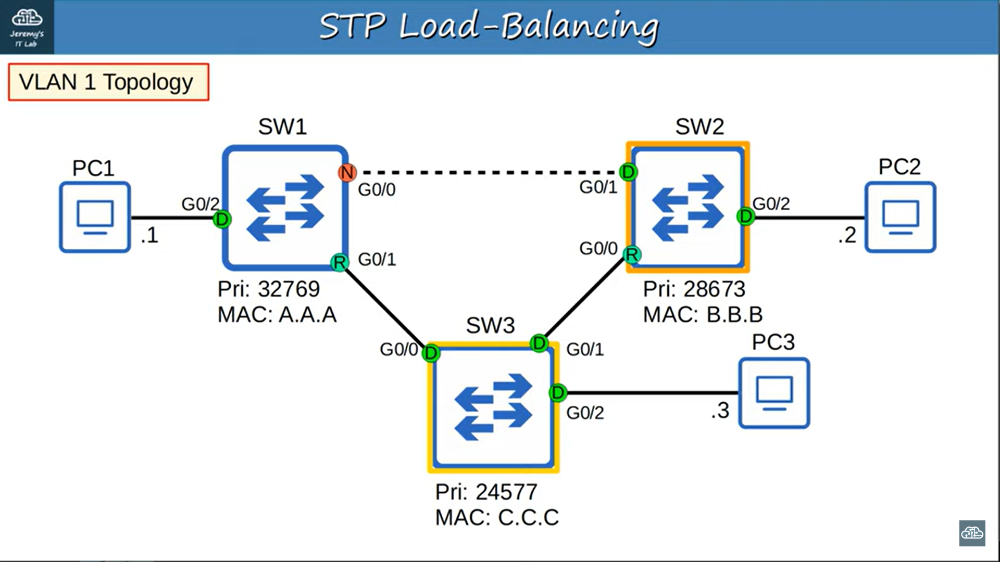
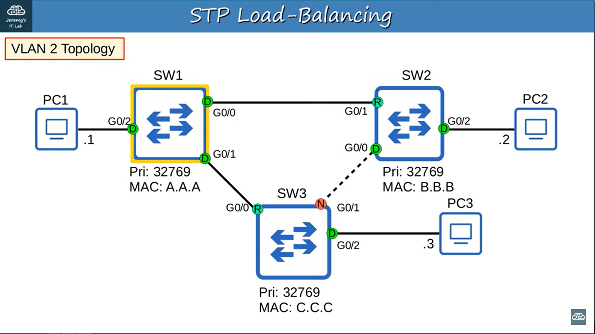

### Spanning Tree Port States
- Non-Designated - Blocking
    - only receive and not forwarding BPDUs
    - not learning MAC addresses and adding to table
- interface is activated / blocking -> forwarding - Listening & Learning
    - Listening:
        - only designated/root ports enter listening state
        - forward delay timer: 15 sec
        - only forward/receive BPDUs
        - not learning MAC address from regular traffic
        - not sending/receive regular network traffic
    - Learning:
        - designated/root ports enter learning state
        - forward delay timer: 15 sec
        - only forward/receive BPDUs
        - learn MAC address from regular traffic
        - not sending/receive regular network traffic
- Root & Designated - Forwarding
    - forward/receive BPDUs
    - forward/receive regular traffic
    - learn MAC address 

 

| STP Port State | Stable/Transitional |
| --- | --- |
| Blocking | Stable |
| Listening | Transitional |
| Learning | Transitional |
| Forwarding | Stable |

 

 

### Spanning Tree Timers
- if Max Age == 0, switch reevaluate its STP choices (i.e root bridge, root port, designated, non-designated)
- non-designated -> designated
    - max age (20 sec)
    - listening (15 sec)
    - learning (15 sec)
    - total: 50 sec
    - to make sure no loops are accidentally created
- designated -> non-designated
    - max age (20 sec)
    - blocking an interface won't create loop

 

| STP Timer | Purpose | Duration |
| --- | --- | --- |
| Hello | How often the root bridge sends hello BPDUs | 2 sec |
| Forward Delay | How long the switch stays in Listening and Learning states (15*2 = 30) | 15 sec |
| Max Age | How long an interface wait to change the STP topology after ceasing to receive Hello BPDUs. Timer resets every time BPDU received | 20 sec (10 Hello) |

 

 

### STP Load Balancing
- in each VLAN, different interface is disabled

 

 

 

 

### Spanning Tree Protocol Toolkit
1. PortFast
    - **edge version is used in CCNA**
    - blocking -> forwarding right away (no need to wait for 30 sec)
    - only used between end host and switches
    - used between switches will cause a loop to happen
    - `spanning-tree portfast` - enable portfast on an interface
    - `spanning-tree portfast disable` - disable portfast
    - `spanning-tree portfast default` - enable portfast on all interfaces in access mode 
    - `spanning-tree portfast trunk` - enable portfast on interfaces in trunk mode
        - for cases when trunk ports not connecting two switches
        - e.g. virtualization server & switch / ROAS

2. BPDU Guard
    - interface receives BPDU from another switch, interface will shut down (enter ErrDisable state) to prevent forming loop
    - `spanning-tree bpduguard enable` - enable bpdu guard on an interface
    - `spanning-tree portfast bpduguard default` - enable bpduguard on all PortFast-enabled interfaces
    - `spanning-tree bpduguard disable` - disable bpduguard on a port

    Reactive port:
    - Manual:
        - `shutdown` + `no shutdown` - activate the interface again if it is shutdown
    - Automatic:
        - `show errdisable recovery` - show ErrDisable Reasons and Timer status
        - `errdisable recovery` - automatically re-enables err-disabled ports after certain period of time
        - `errdisable recovery interval <second>` - change the interval to re-enable port (default 5 min)
        - `errdisable recovery cause <errdisable reason>` - enable timer status of specified errdisable reason

3. BPDU Filter
    - `spanning-tree bpdufilter enable` - enable bpdufilter on an interface
        - not sending BPDUs
        - ignore BPDUs received
        - BPDU guard is not triggered (if bpduguard is enabled)
    - `spanning-tree portfast bpdufilter default` - enable bpdufilter on all PortFast-enabled interfaces
        - not sending BPDUs
        - operate as normal STP port if received BPDUs and disable PortFast and bpdufilter
        - BPDU guard is triggered (if bpduguard is enabled)
    - `spanning-tree bpdufilter disable` - disable bpdufilter on a port

4. Root Guard
    - switch will not accept the new switch as root bridge if it receives superior BPDU from that switch (enter **Broken / Root Inconsistent** state)
    - interface will be disabled
    - `spanning-tree guard root` - enable root guard
        - if received superior BPDU
            - port disabled
            - **Designated --- Designated** connection is created
        - to reactivate the port
            - change the port-priority value of switch to make sure switch with root guard will not be receiving any superior BPDU
            - after max age interval of 20 seconds, the port will be activated again
            - **Designated --- Root Port** connection is connected

5. Loop Guard
    - detect unidirectional link and prevent layer 2 loop
    - `spanning-tree guard loop` - enable loop guard on a port
    - `spanning-tree loopguard default` - enable loop guard on all ports
    - `spanning-tree guard none` - disable loop guard on a port
    - when loop guard is enabled
        - when max age timer == 0 (Not accepting BPDUs for 20 sec), enter **Broken** state
        - once receiving BPDUs again, port is automatically re-enabled
        - since not directly changing the port to forwarding state, it prevents loop
    - **Recommended**: Always enable loop guard no **non-designated** port

**NOTE:**
1. Loop guard and Root guard can't be enabled on the same port at the same time
2. If Loop guard is enabled after Root guard, Root guard will be disabled, vice versa
3. More specific configuration (per port) will replace less specific configuration (default)

### Command (STP Configuration)
- `spanning-tree mode <stp mode>` - change stp mode
- `spanning-tree vlan <vlan num> root primary` - set primary root bridge by changing the Bridge Priority value to ensure it has the lowest (default 24576)
- `spanning-tree vlan <vlan num> root secondary` - set secondary root bridge (default 28672)
- `spanning-tree vlan <vlan num> cost <root cost>` - change the root cost of an interface
- `spanning-tree vlan <vlan num> port-priority <port-priority val>` - change the port-priority value of an interface
    - STP port ID: 0x8002 (default)
    - 0x80 = 128
- `show spanning-tree interface <interface id> detail` - show the details of STP on an interface