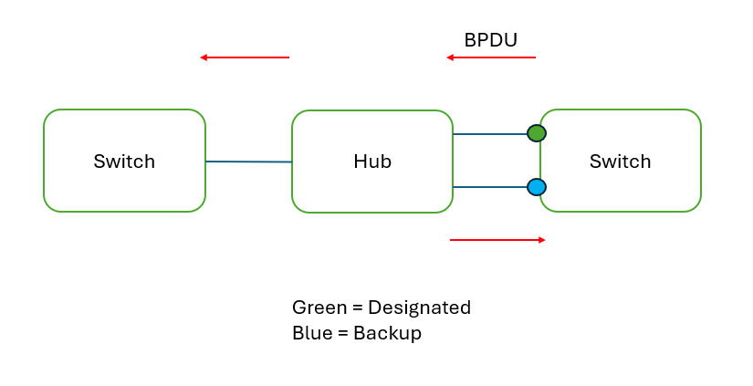

### IEEE VS Cisco
**IEEE**
1. Spanning Tree Protocol (802.1D)
- all VLANs share one STP instance (can't load balance)

2. Rapid Spanning Tree Protocol (802.1W)
- faster at converging to network changes
- all VLANs share one STP instance (can't load balance)

3. Multiple Spanning Tree Protocol (802.1s)
- use modified RSTP mechanics
- group multiple VLANs into different instances (e.g. VLAN1-10 into instance 1)

**Cisco**
1. Per-VLAN Spanning Tree --> Per-VLAN Spanning Tree Plus (PVST+)
- each VLAN has its own STP instance (can load balance)

2. Rapid Per-VLAN Spanning Tree Plus (Rapid PVST+)
- faster at converging to network changes (listening and learning state)
- each VLAN has its own STP instance (can load balance)

 

 

### Rapid STP 
- everything same as classic STP
- Root cost is different for each speed
    | Speed | STP Cost | RSTP Cost |
    | --- | --- | --- |
    | 10 Mbps | 100 | 2,000,000 |
    | 100 Mbps | 19 | 200,000 |
    | 1 Gbps | 4 | 20,000 |
    | 10 Gbps | 2 | 2,000 |
    | 100 Gbps | x | 200 |
    | 1 Tbps | x | 20 |
- Port States is different 
    | STP | RSTP |
    | --- | --- | 
    | Blocking + Listening + Disable | Discarding |
    | Learning | Learning |
    | Forwarding | Forwarding |
- Non-Designated ---> Alternate & Backup 
    - Alternate
        - same as blocking / non-designated
        - backup to the root port
        - immediately move its best alternate port to forwarding it root port fails
        - same as **uplinkfast** in STP
    - Backup
        - discarding port that receives a superior BPDU from another interface on the same switch (only happens via hub)
        - if another port (designated) fails, backup port become disignated port
        - interface with lowest port ID selected as designated port, other become backup port

                
        
        

         
- root bridge originate BPDU and other switches send it (Classic STP)
- all switches originate BPDU and send to other switches (RSTP)
    - every 2 sec, swiches send their own BPDUs
    - max age: 20 sec (Classic STP); 6 sec (RSTP)
    - switches (RSTP) clear all MAC addresses learned on that interface disconnected after 6 seconds
- link types
    | Link Type | Desc | Command |
    | --- | --- | --- |
    | Edge | portfast connection (normally connected to end host) | `spanning-tree portfast` |
    | Point-to-point | direct connection between two switches (full duplex) | `spanning-tree link-type point-to-point` |
    | Shared | connection to hub (half duplex) | `spanning-tree link-type shared` |

