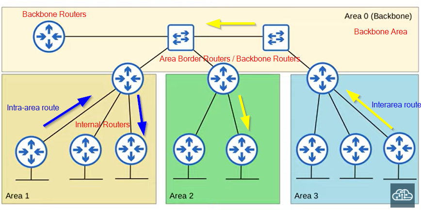

### Open Shortest Path First (OSPF)
- using Dijkstra algo
- three versions:
    OSPFv1 - legacy
    OSPFv2 - IPv4
    OSPFv3 - IPv6
- routers store info about network in Link State Advertisements (LSA), organized in Link State Database (LSDB)
- routers flood LSAs until all routes in the OSPF area develop the same map (LSDB)
    - LSA aging after 30 min (default) then flood again
- process of OSPF:
    1. Become neigbours with other routers connected to the same segment
    2. Exchange LSAs
    3. Each router calculate the best routes to each destination and insert them into the routing table

<br>
<hr>
<br>

### OSPF Areas
- areas used to divide up the network
- Cons of having single-area design in large network 
    1. SPF algo takes more time to calculate routes
    2. SPF algo need more processing powers on the routers
    3. Larger LSDB takes up more memory
    4. Small Change in network cause every router to flood LSAs and run SPF algo again
- **area** - set of routers and links that share the same LSDB
- **backbone area** - area that all other areas must connect to
- **internal routers** - routers with all interfaces in the same area
- **area border routers (ABR)** - routers with interfaces in multiple areas
- **backbone routers** - routers connected to the backbone area
- **intra-area route** - route to destination inside same OSPF area
- **interarea route** - route to a destination in a different OSPF area
- Rule:
    1. Same area should be connected (e.g. Area 1 and Area 1)
    2. All OSPF areas must have at least one ABR connected to the backbone area
    3. OSPF interfaces in the same subnet must be in the same area, vice versa
    4. OSPF process must not shutdown
    5. OSPF router ID must be unique
    6. Hello and Dead timers must match
    7. Authentication settings must match
    8. IP MRU settings must match
    9. OSPF network type must match
- Command:
    - `router ospf <process ID>`
        - process ID is same as AS but different router don't need the same process ID in the same area
    - `network <ip/network addr> <wildcard subnet> area <area>`
    - `ip ospf <process id> area <area>` - active OSPF on an interface
    - `passive-interface <interface id>`
    - `passive-interface default` - all interfaces are passive interface
    - `default-information originate`
    - `show ip protocols`
        - selection of router is same as EIGRP
            - `router-id <router id>`
        - **autonomous system boundary router** - OSPF router that connects the OSPF network to an external network (Internet)
        - `maximum-paths <val>`
        - `distance <val>`
    - `ip ospf hello-interval <sec>` - change the hello timer
    - `ip ospf dead-interval <sec>` - change the dead timer
    - `no ip ospf <router id/ hello-interval/ dead-interval/ authentication/ authentication-key <key>>` - set them back to default value
    - `ip ospf authentication-key <key>` - set the authentication key of the ospf on an interface
    - `ip ospf authentication` - start the authentication from an interface
    - `ip mtu <mtu val>` - change ip mtu value
    - `show ip ospf database` - view the details of ospf database on a router
    - `show ip ospf int <interface id>` - view the details of interface in ospf 
    - `clear ip ospf process`

<br>



<br>
<hr>
<br>

### OSPF Cost
- calculated based on the bandwidth of the interface
- default reference bandwidth: 100Mbps
    - Reference: 100 Mbps / Interface: 10 Mbps = cost of 10
    - Reference: 100 Mbps / Interface: 100 Mbps = cost of 1
    - Reference: 100 Mbps / Interface: 1000 Mbps = cost of 1 (value < 1 converted to 1)

    - `auto-cost reference-bandwidth <val>` - change the default reference bandwidth **(megabits/s)**
        - the value should freater than the fastest link in the network
        - every router should have the same reference bandwidth

    - `ip ospf cost <val>` - change the cost of a specific interface
    - `bandwidth <val>` - change the bandwidth of a specific interface **(kilobits/s)**

<br>
<hr>
<br>

### OSPF Neighbours
- when OSPF activated on an interface, the router sends OSPF Hello messages (every 10 sec)
- Hello Message are multicast to 224.0.0.5 

1. **Down State**
- R1 send Hello packet out of activated interface without knowing OSPF neighboour (Neighbour RID = 0.0.0.0)

```
         ------------------------ 
        |     RID: 1.1.1.1       |
        | Neighbour RID: 0.0.0.0 |
         ------------------------

R1 -------------------------------------> R2
```

2. **Init State**
- R2 add entry for R1 to its OSPF neighbour state
- R2 router ID is not in the Hello packet yet (Neighbour RID = 0.0.0.0)

```
         ------------------------ 
        |    My RID: 1.1.1.1     |
        | Neighbour RID: 0.0.0.0 |
         ------------------------
R1 -------------------------------------> R2
```

3. **2-way state**
- router received a Hello packet with its own RID in it
- routers are ready to share LSAs to build common LSDB
- Designated Router (DR) / Backup Designated Router (BDR) elections is used in some network

```
         ------------------------ 
        |    My RID: 2.2.2.2     |
        | Neighbour RID: 1.1.1.1 |
         ------------------------
   <-------------------------------------
        ------------------------ 
        |    My RID: 1.1.1.1     |
        | Neighbour RID: 2.2.2.2 |
         ------------------------
R1 --------------------------------------> R2
```

4. **Exstart State**
- need to choose which router start the exchange 
- higher RID -> Master / lower RID ->  Slave
- send DBD (Database Description) packets to each other

```
         -------------------- 
        |       DBD          |
        | I'll be the master |
         --------------------
    ------------------------------------->
         ------------------------ 
        |         DBD            |
        | No, I'll be the master |
         ------------------------
R1  <------------------------------------- R2
```

5. **Exchange State**
- routers exchange DBDs, telling others what LSAs they have without telling details 
- routers compare the information with its own LSDB to determine which LSAs to receive from their neighbour

```
         -------------------- 
        |       DBD          |
        | I have these LSAs. |
         --------------------
    <-------------------------------------
         --------------------
        |        DBD         |
        | I have these LSAs. |
         --------------------
R1  -------------------------------------> R2
```

6. **Loading State**
- routers send Link State Request (LSR) to request for LSAs they don't have
- neighbour routers return LSAs requested in Link State Update (LSU) messages
- after receiving, router send LSAck message back to acknowledge that they received the LSAs

```
                 ----------
                |   LSR    |
                 ----------
    -------------------------------------> 
                 ----------
                |   LSU    |
                 ----------
    <-------------------------------------
                 ------------
                |   LSAck    |
                 ------------
    -------------------------------------> 

R1                                          R2

                 ----------
                |   LSR    |
                 ----------
    <-------------------------------------
                 ----------
                |   LSU    |
                 ----------
    ------------------------------------->
                 ------------
                |   LSAck    |
                 ------------
    <-------------------------------------
    
```

7. **Full State**
- routers have full OSPF adjacency and identical LSDBs
- routers continue send Hello Packet (every 10 second)
- dead timer (default: 40 sec) is reset once receiving Hello Packet
- neighbour is removed if dead timer = 0

<br>
<hr>
<br>

### Loopback Interfaces
- virtual interface in the router
- if other physical interface fails, it can be used to reach/identify the router (always up/up state)

<br>
<hr>
<br>

### OSPF Network Types
Three Main OSPF Network Types:
1. Broadcast - enabled by default on Ethernet and Fiber Distributed Data Interfaces (FDDI interface)
2. Point-to-point - enabled by defaut on PPP (Point-to-Point protocol) and High-Level Data Link Control (HDLC interface)
3. Non-Broadcast - enabled by default on Frame Relay and X.25 interfaces
    - hello interval = 3*hello interval (broadcast)
    - dead interval = 3*dead interval (broadcast)

- `ip ospf network <network type>` - change the network type of an interface
<br>

### Broadcast
DR/BDR Election
1. Highest OSPF interface priority (default 1)
2. Highest OSPF Router ID

- first place become DR (Full State)
- second place become BDR (Full State)
- others become DROther (Full State)
- messages to DR/BDR are multicast using address 224.0.0.6
- DR and BDR form full adjacency with all routers in the subnet
- DROthers form a full adjacency only with DR/BDR

- `ip ospf priority <priority>` - change the priority value of an interface
    - if priority set to 0, router cannot be DR/BDR of the subnet
    - the state will only change after other routers' interface that holds DR or BDR **shutdown/reset/fails**
    - if **current DR** goes down, **current BDR** become **current DR**, start election for the **next BDR** (so even priority increases, the interface will only become BDR before the next reset)

<br>

### Point-to-point
- enabled on serial interfaces using PPP or HDLC encapsulation
- send/listen OSPF Hello messages using multicast address 224.0.0.5
- no DR/BDR election
- two routers will form full adjacency 

Serial Interface (Legacy)
- layer 2
- one side function as Data Communications Equipment (DCE); one side is Data Terminal Equipment (DTE)
- DCE side needs to specify the clock rate (aka speed in Ethernet)
- `encapsulation <mode>` - change encapsulation to HDLC/PPP either one
- `show controllers <interface id>` - identify which side is DEC/DTE
- `clock rate <bits/s>` - configure the clock rate of DCE


<br>
<hr>
<br>

### OSPF LSA Types
11 types but only 3 should be aware:
1. Type 1 (Router LSA)
    - identify router using its router id
    - lists network attached to the router's OSPF-activated interfaces
2. Type 2 (Network LSA)
    - generated by DR of each broadcast network
    - lists the routers which are attached to the broadcast network
3. Type 5 (AS External LSA)
    - generated by ASBRs to describe routers to destination outside of the AS

### OSPF Message Type
1 - Hello
2 - DBD
3 - LSR
4 - LSU
5 - LSAck


If IP MTU mismatch: become neighbour but not full state
If network type mismatch: full state but not learn OSPF routes