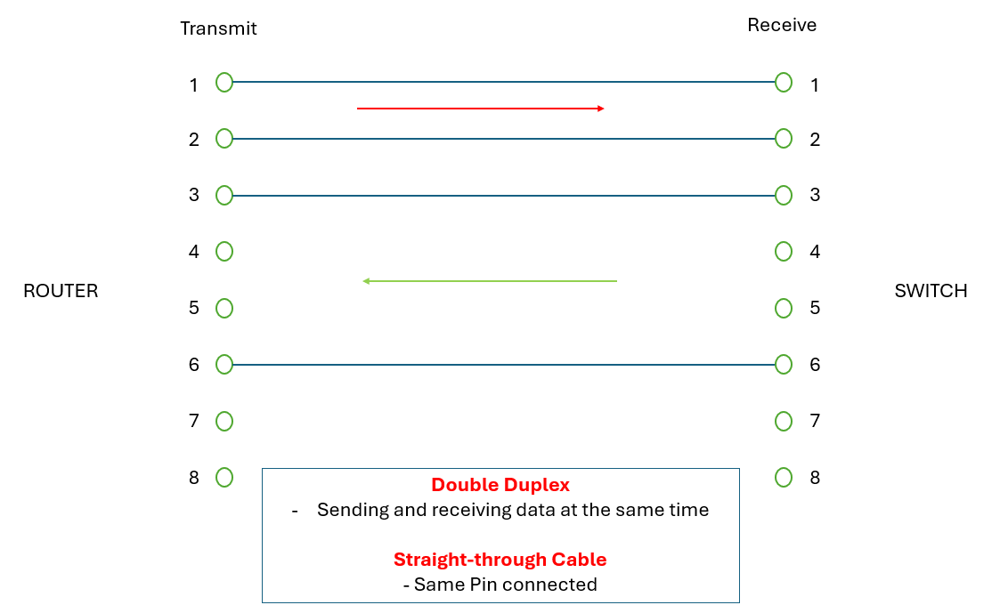
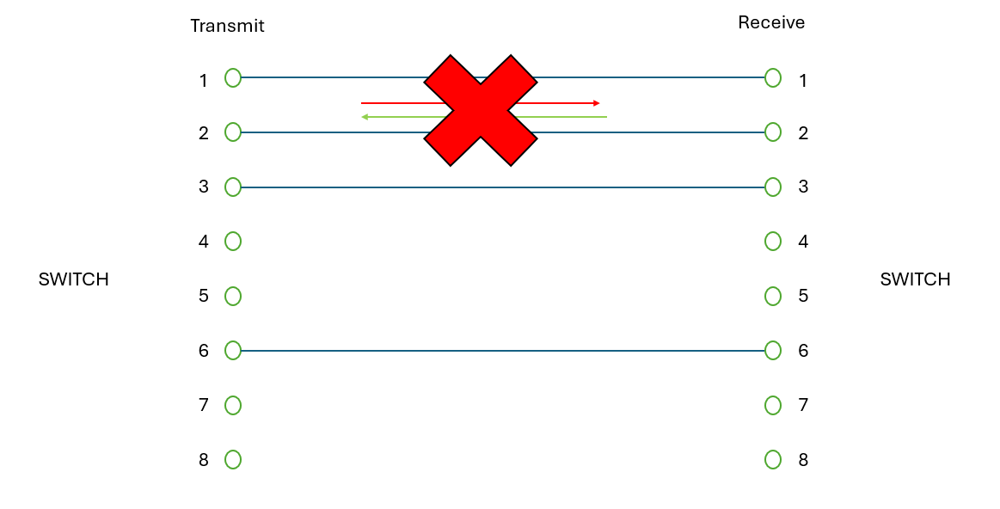
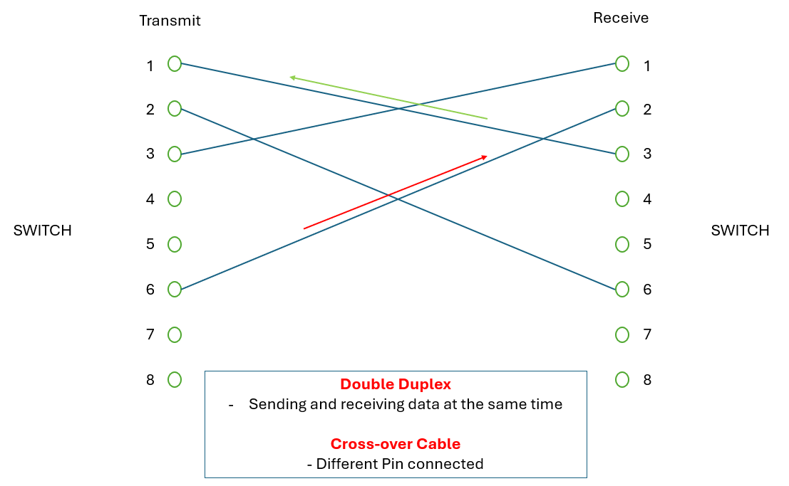
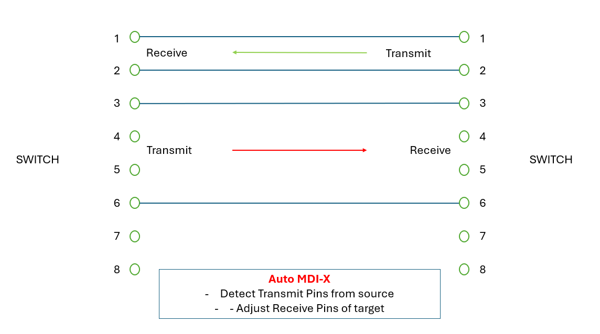
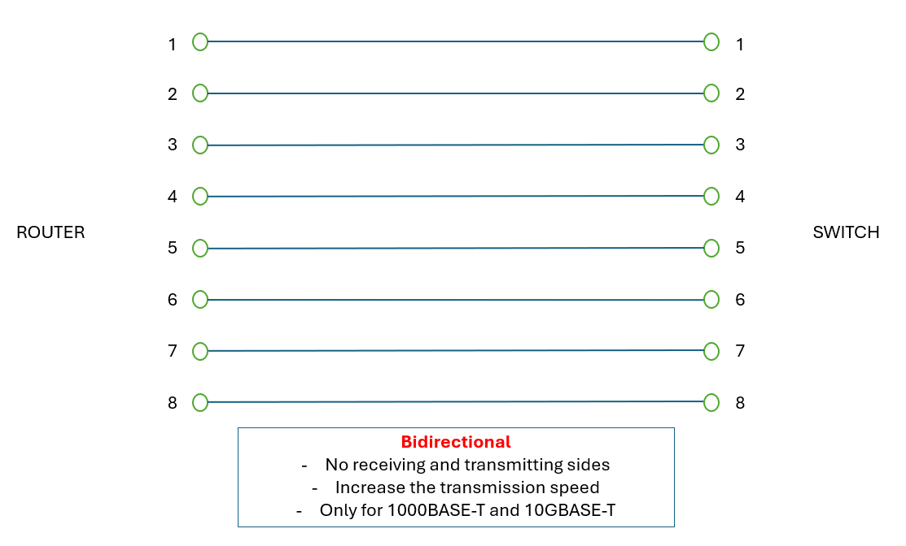
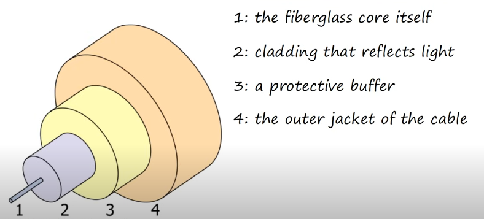

**Ethernet** 
- collection of network protocols / standards
- network protocols / standard is important to provide common standards which allow connectivity between network devices

**Speed of Connection**
- bits/sec
- Os and 1s
- 8 bits = 1 byte
- tera >> giga >> mega >> kilo

**Ethernet Standard**
- IEEE 802.3 (Institute of Electric and Electronic Engineers)
- Copper:
    | Speed | Common Name | IEEE Standard | Informal Name | Maximum Length | Pairs |
    | --- | --- | --- | --- | --- | --- |
    | 10 Mbps | Ethernet | 802.3i | 10BASE-T | 100m | 2 |
    | 100 Mbps | Fast Ethernet | 802.3u | 100BASE-T | 100m | 2 |
    | 1 Gbps | Gigabit Ethernet | 802.3ab | 1000BASE-T | 100m | 4 |
    | 10 Gbps | 10 Gig Ethernet | 802.3an | 10GBASE-T | 100m | 4 |
    - BASE: baseband signaling
    - T: Twisted Pair
- Fiber Optic
    | Speed | Name | IEEE Standard | Cable Type | Maximum Length |
    | --- | --- | --- | --- | --- |
    | 1 Gbps | 1000Base-LX | 802.3z | Multimode/Single-Mode | 550m (MM) / 5km (SM) |
    | 10 Gbps | 10GBASE-SR | 802.3ae | Multimode | 400m |
    | 10 Gbps | 10GBASE-LR | 802.3ae | Single-Mode | 10km |
    | 10 Gbps | 10GBase-ER | 802.3ae | Single-Mode | 30km |

 

 

**UTP cables**
- Unsheilded + Twister + Pair
- Twisted protects against electromagnetic Interference
- Might leak signal outside of the cable (security risk)
- 8 wires -> 4 Pairs

| Device Type | Transmit (Tx) Pins | Receive (Rx) Pins |
| --- | --- | --- |
| Router | 1,2 | 3,6 |
| Firewall | 1,2 | 3,6 |
| PC | 1,2 | 3,6 |
| Switch | 3,6 | 1,2 |

 

 

 

 

 

 

 

**Fibre Optic Cable**
  - Send light over glass fibles instead of electric signal
  - Connect to SFP Transceiver (Small Form-Factor Pluggable)
  - Two Connectors at each end for trasmitting and receiving

 

**Multimode VS Single-Mode**
  | Multimode | Single-Mode |
  | --- | --- |
  | Wide Core diameter | Narrow Core Diameter |
  | Multiple light angles | Single light angle |
  | Shorter | Longer |
  | Cheap | Expensive |

 

