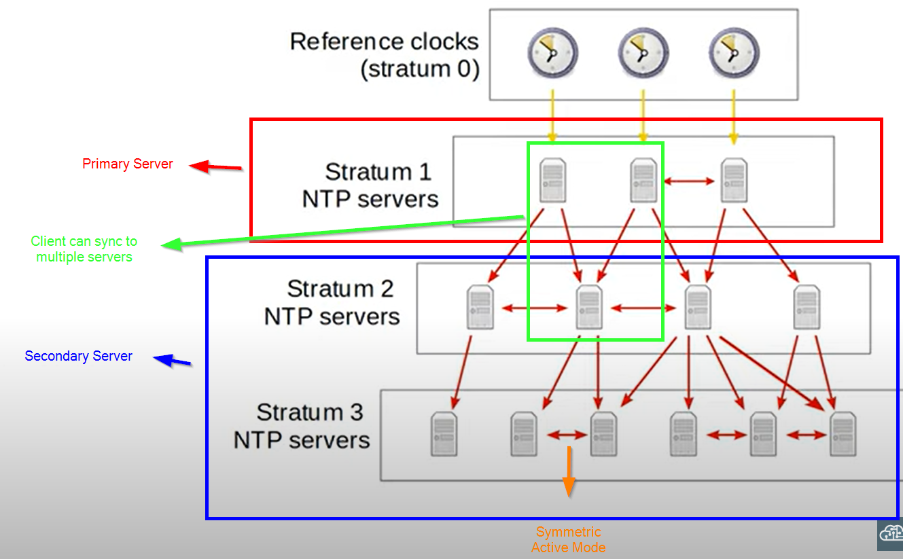

### Internal Clock
- all devices have internal clock
- `show clock` - default time zone is UTC (Coordinated Universal Time)
- `show clock detail` - + time source (default: hardware calendar)
- `clock set <hh:mm:ss> <dd mm yyyy>` - change the software clock time on device
- `calendar set <hh:mm:ss> <dd mm yyyy>` - change th hardware clock time on device
- `clock update-calendar` - sync calendar to software clock time
- `clock read-calendar` - sync software clock to calendar time
- `clock timezone <timezone> <hours offset from UTC> <minutes offset from UTC>` - change the timezone (**global config mode**)
- `clock summer-time <timezone> recurring <start of timezone> <end of timezone>`
    - start/end of timezone:
        1. Week to start
        2. Day to start
        3. Month to start
        4. Time to start

 

 

### Network Time Protocol (NTP)
- allow syncing of time over a network
- NTP client request time from NTP server (device can be server and client at the same time)
- allow accuracy within 1 millisecond (if in same LAN) / 50 milliseconds (if over WAN)
- accuracy based on distance of NTP server from original reference clock (== stratum)
- use UDP port 123
- `ntp server <server ip>` - assign ntp server 
    - can be more than one
    - will take the fastest response among servers set
- `show ntp associations` - show ntp configuration set
- `show ntp status` - show more information of ntp configuration
- `ntp source <interface id>` - ntp message will send out from this interface to other devices (always choose loopback interface)
- `ntp master <stratum>` - make the device act as NTP master clock
    - default stratum = 8
- `ntp peer <peer ip>` - symmetric active mode
- authentication:
    - `ntp authenticate` - enable NTP authentication
    - `ntp authentication-key <key number> md5 <key>` - create authentication key
    - `ntp trusted-key <key number>` - create trusted key
    - `ntp server <ip> key <key number>`
        - don't need this command for server

### Reference Clock
- like an atomic clock or GPS clock
- NTP hierarchy (max: stratum 15):

 

"*" next to time in the output of `show clock` means the time is not authoritative
