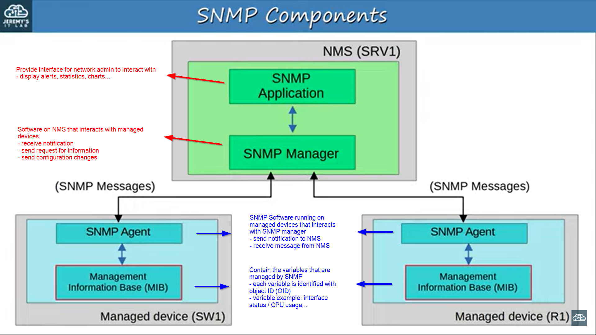

### Simple Network Management Protocol (SNMP)
- used to monitor the status of devices or making configuration changes
- two main devices:
    1. Managed Devices
       -  e.g. routers / switches
    2. Network Management Station (NMS)
       - SNMP server
- three main operations:
    1. Managed Devices can notify the NMS of events
    2. NMS can ask the managed devices for information about their current status
    3. NMS can tell managed devices to change aspects of their configuration
- SNMP Agent: UDP 161
- SNMP Manager: UDP 162 

 

 

### SNMP Components

 

### SNMP OIDs
Example: .1.3.6.1.2.1.1.5
- 1 = iso
- 3 = identified organization
- 6 = dod
- 1 = Internet
- 2 = mgmt
- 1 = mib-2
- 1 = system
- 5 = sysName

### SNMP Version
1. SNMPv1
    - original version 
    - message sent in plain text

2. SNMPv2c
    - allow NMS to retrieve large amount of information within a single request
    - "c" = community string = password
    - message sent in plain text

3. SNMPv3
    - support strong encryption and authentication

### SNMP Messages
**Read**
1. Get
    - request sent from manager to retrieve value of variable (OID)
    - agent will send **Response** message with current OID

2. GetNext
    - request sent from manager to agent to discover avalable variables in MIB

3. GetBulk
    - more efficient version of GetNext message (SNMPv2)

**Write**
1. Set
    - request from manager to change the value of one or more variables
    - agent send **Response** message with new values

**Notification**
1. Trap 
    - notification sent from agent 
    - manager does not send **Response** message to acknowledge
    - unreliable

2. Inform
    - same as Trap
    - but manager send **Response** message to acknowledge

**Response**
1. Response
    - response to previous massage/request

 

 

### SNMP Configuration
- `snmp-server contact <contact addr>` - optional information
- `snmp-server location <location>` - optional information
- `snmp-server community <password> <ro/rw>` - configure SNMP password
    - ro = read only (no Set messages)
    - rw = read/write (can use Set messages)
    - default password: Public(ro) / Private(rw)
- `snmp-server host <NMS ip> version <version> <password>` - specify NMS, version and community
- `snmp-server enable traps <trap type>` - configure trap types to send to NMS
    - send Traps message when specified event happens