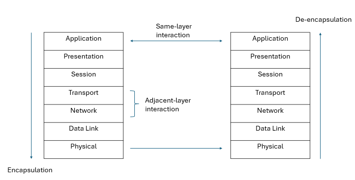
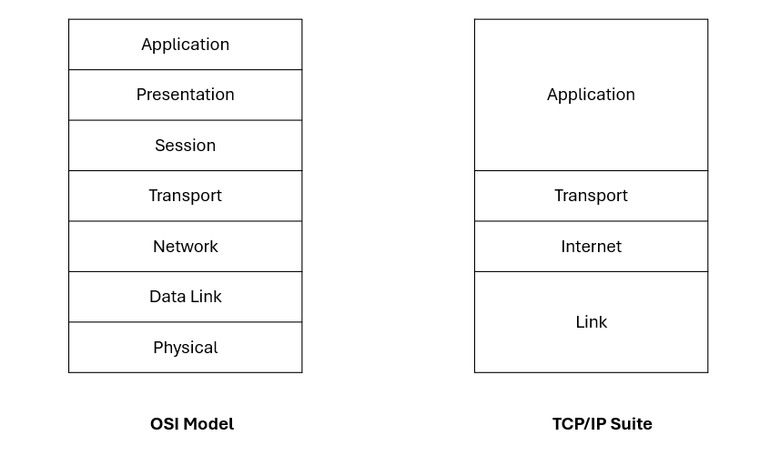
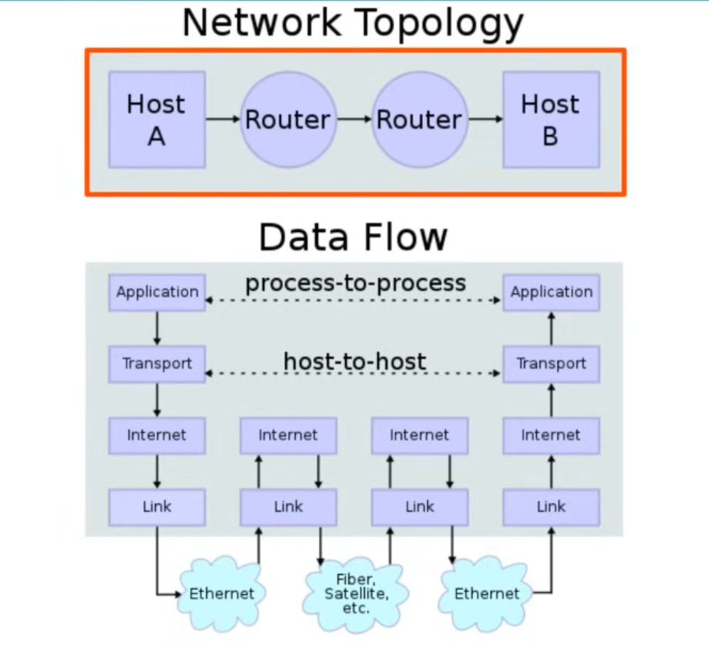

**Networking Model** - categorize and provide structure for networking protocols and standards

**OSI Model**
- Open System Interconnection model
- created by ISO
- standardizing network communications

<br>



<br>
<hr>

### Application Layer
- interact with software applications (e.g. browsers)
- **Not including application itself**
- Example: HTTP/HTTPS
- Functions
    - identify communication partners
    - synchronize communication

### Presentation Layer
- Functions
    - translate between application and network format
    - perform encryption and decryption

### Session Layer
- Functions
    - control sessions between hosts
    - establish, manage and terminate connections between local and remote applications

```
Protocol Data Units (PDU): Data
 _ _ _ _ _ 
|          |
|   Data   |
|_ _ _ _ _ |
 
```

### Transport Layer
- Functions
    - segment and reassemble data
    - break data into smaller segments to avoid transmissions problems if errors occurs
    - provide end-to-end communications

```
PDU: Segment
 _ _ _ _ _ _ _ _ _ _ _ _ _ 
|          |               |
|   Data   |   L4 Header   |
|_ _ _ _ _ | _ _ _ _ _ _ _ |
 
```

### Network Layer
- Functions
    - provide connectivity between different LAN
    - provide IP address
    - provide path selection between source and destination
    - **Router operate here**

```
PDU: Packet
 _ _ _ _ _ _ _ _ _ _ _ _ _ _ _ _ _ _ _ _ _
|          |               |               |
|   Data   |   L4 Header   |   L3 Header   |
|_ _ _ _ _ | _ _ _ _ _ _ _ | _ _ _ _ _ _ _ |
 
```

### Data Link Layer
- Functions
    - provide node-to-node connectivitiy and data transfer
    - define how data is formatted for transmission over physical medium (e.g. copper UTP cables)
    - detect and correct physical layer error
    - use layer 2 addressing (MAC address)
    - **Switch operates here**

```
PDU: Frame
 _ _ _ _ _ _ _ _ _ _ _ _ _ _ _ _ _ _ _ _ _ _ _ _ _ _ _ _ _ _ _ _ _ _ _ _ _ _
|                |          |               |               |               |
|   L2 Trailer   |   Data   |   L4 Header   |   L3 Header   |   L2 Header   | 
|_ _ _ _ _ _ _ _ | _ _ _ _ _|_ _ _ _ _ _ _ _|_ _ _ _ _ _ _ _|_ _ _ _ _ _ _ _|
 
```

### Physical Layer
- Functions
    - define physical characteristics of trasmission medium
        - voltage levels
        - maximum transmission distance
        - physical connectors
        - cable specifications
    - convert digital bits into electrical (wired) / radio (wireless)

```
PDU: Bit (No futher encapsulation)
 _ _ _ _ _ _ _ _ _ _ _ _ _ _ _ _ _ _ _ _ _ _ _ _ _ _ _ _ _ _ _ _ _ _ _ _ _ _
|                |          |               |               |               |
|   L2 Trailer   |   Data   |   L4 Header   |   L3 Header   |   L2 Header   | 
|_ _ _ _ _ _ _ _ | _ _ _ _ _|_ _ _ _ _ _ _ _|_ _ _ _ _ _ _ _|_ _ _ _ _ _ _ _|
 
```

<br>
<hr>
<br>

### <u>TCP/IP Suite</u>


<br>

