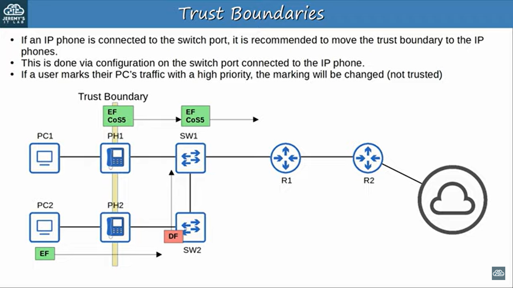
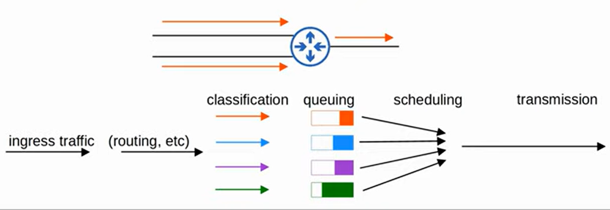
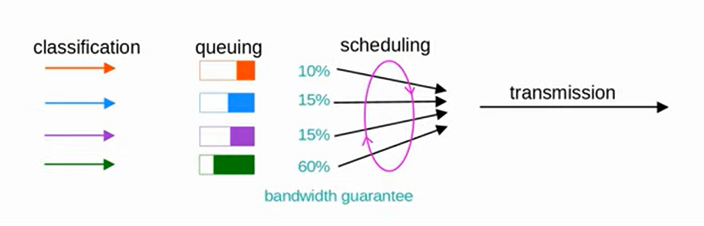
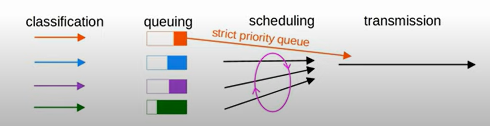

### IP Phones / Plain Old Telephone Service (POTS)
- operate over the public switched telephone network (PSTN)
- use Voice over IP (VoIP) to enable phone calls over IP network
- has an internal 3-port switch
    1. uplink to external switch
    2. downlink to PC
    3. internally to phone itself
- allow PC and IP phone to share a single switch port
- (Recommended): place voice traffic and data traffic into separate VLANs using voice VLAN
    - traffic from PC will be untagged
    - traffic from phone will be tagged with a VLAN ID
- use Power over Ethernet (POE) to get electricity

### Voice VLAN Configuration
- `switchport voice vlan <vlan id>`
    - though normal access vlan and voice vlan sent out from the same interface, the interface is still considered an access port (not trunk)

### Power over Ethernet (POE)
- allows Power Sourcing Equipment (PSE, i.e. Switch) to provide power to Powered Devices (PD, e.g. IP Phone / Wireless Access Point) over an Ethernet cable
- PSE convert AC to DC and supply to PDs
- too much electricity may damage PDs
    - when device connected to POE-enabled port, PSE send low power signal to determine how much power the PD needs
    - if device needs power, PSE supply power to allow PD to boot
    - PSE continue monitor the PD and supply required amount of power
    - Power policing: prevent too much power sending to PDs
        - `power inline police` / `power inline police action err-disable`: disable the port and send syslog message
        - `power inline police action log`: restart the port and send syslog message (no disable port)

<br>

| Name | Standard | Watts | Powered Wire Pairs |
| --- | --- | --- | --- |
| Cisco Inline Power (ILP) | Made by Cisco | 7 | 2 |
| POE (Type 1) | 802.3af | 15 | 2 |
| POE+ (Type 2) | 802.3at | 30 | 2 |
| UPOE (Type 3) | 802.3bt | 60 | 4 |
| UPOE+ (Type 4) | 802.3bt | 100 | 4 |

**4/5, 7/8 pairs are used**

<br>
<hr>
<br>

### Quality of Service (QoS)
- apply different treatment to different packets
- things managed:
    1. Bandwidth
        - bits/sec
        - reserve certain amount of link's bandwidth for specific traffic
    2. Delay
        - **one-way delay**: time traffic takes from source to dest
        - **two-way delay**: time traffic take from source to dest and return
    3. Jitter
        - variation in one-way delay between packets sent by same application
    4. Loss
        - packts sent that do not reach their destination
        - can caused by faulty cables or when device's packet queue get full and device discard the packets

    Recommended standards:
    - one-way delay: <= 150ms
    - Jitter: <= 30ms
    - Loss: <= 1%

### Queuing
- FIFO manner
- if full, new packets will be dropped (i.e. **tail drop**)
- tail drop can lead to **TCP global synchronization**
    - TCP Sliding Window:
        1. host using TCP use sliding windows to increase/decrease the rate of sending traffic
        2. when packet is dropped, it will be re-transmitted
        3. sender will reduce the rate of sending traffic
        4. gradually increase the rate again
    - TCP hosts will increase the rate together and cause more congestion

        ```
        Network Congestion ---> Tail Drop ---> Global TCP window size increase ---> Network underutilized ---> Global TCP window size decrease
                ^                                                                                                               |    
                |_______________________________________________________________________________________________________________|                     
        ```
- Solution to solve TCP Global Synchronization:
    - Random Early Detection (RED)
        - when reaches certain threshold (queue), randomly drop packets
    - Weighted Random Early Detection (WRED)
        - control which packets are dropped 
        - lower priority will be dropped
         
### Classification
- organize network traffic into traffic classes
- methods:
    - ACLs
    - NBAR (Network Based Application Recognition): perform deep packet inspection (until Layer 7) to identify traffic kind
- QoS in PCP (Priotity Code Point)
    - defined by IEEE 802.1q
    - can only be used when it is a tagged frame
    
    <br>

    **PCP Marking:**

    | PCP | Traffic Types |
    | --- | --- |
    | 0 | Best Effort (default) |
    | 1 | Background |
    | 2 | Excellent Effort |
    | 3 | Critical Applications |
    | 4 | Video |
    | 5 | Voice |
    | 6 | Internetwork control |
    | 7 | Network control |

    **IP phones establish call (PCP3), then actual voice call (PCP5)**

    <br>

- DSCP in IPv4 header
    - legacy:
        ```
        ----------------------------------------------
        | IPP (IP Precedence) | (For other purposes) |
        ----------------------------------------------
        ```
    - **IPP Marking:**
    
        | IPP | Traffic Type |
        | --- | --- |
        | 0 | Best Effort |
        | 3 | Voice Signaling |
        | 4 | Video |
        | 5 | Voice |
        | 6 | Network Control (Reserved) |
        | 7 | Network Control (Reserved) |

    <br>

    - modern:
        ```
        --------------
        | DSCP | ECN |
        --------------
        ```
    - **DSCP Marking (Some):**
        | DSCP | Traffic Type |
        | --- | --- |
        | Default Forwarding (DF) - 0 | Best Effort |
        | Expedited Forwarding (EF) - 46 | Low loss/latency/jitter traffic (usually voice) |
        | Assured Forwarding (AF) | Set of 12 standard values |
        | Class Selector (CS) | Set of 8 standard values, providing compatibility with IPP |

        <br>

    - Assured Forwarding
        - has four traffic classes, packets in the same class have same priority
        - within each class, there are 3 levels of drop precedence
        - higher drop precedence = more likely to drop when congestion
        - format: _ _ _ | _ _ | 0 | _ _ (AFXY)
            - first three = X = Traffic Class
            - middle two = Y = Drop Precedence
            - e.g. 0 0 1 0 1 0 = AF11 = DSCP 10 (8X + 2Y)

    - Class Selector
        - format: _ _ _ | 0 0 0 | _ _
        - IPP(?) = CS(?) = DSCP(8*?)

### Trust Boundaries


### Queuing/Congestion Management
- place the packet in the appropriate queue (based on classification)
- scheduler is then used to decide which queue traffic is forwarded from next



- Scheduling Method:
    1. CBWFQ (Class-Based Weighted Fair Queuing)
        - using weighted round-robin scheduler 
        - weighted = mode data is taken from high priority queues
        - round-robin = packets are taken from each queue in order cyclically
        - **BUT**, round-robin add delay and jitter to voice/video traffic

        

    2. LLQ (Low Latency Queuing)
        - designated one or more queues as strict priority queues
        - scheduler will always take next packet from that queue until it is empty
        - **BUT**, can starve other queues if there is always traffic in the designated queue (can solve by policing)

        

### Shaping & Policing
- both used to control the traffic rate
- **Shaping** - buffers traffic in queue if traffic rate beyond configure rate (prevention: control traffic rate under configured rate)
- **Policing** - drop traffic if traffic rate beyond configured rate (blocking: discard traffic which traffic rate beyong configured rate)

<br>
<hr>
<br>

### QoS Configuration
1. Configure class map
    - `class-map <matching type> <class map name>`
        - matching type:
            1. match-all
            2. match-any
    - `match protocol <protocol>`

2. Configure policy map
    - `policy-map <policy map name>`
    - `set ip dscp <dscp marking>` - set the marking to traffic in this class
    - `priority percent <bandwidth percentage>` - provide minimum bandwidth (specified) as priority queue
    - `bandwidth percent <bandwidth percentage>` - provide minimum bandwidth (specified)

3. Configure service policy
    - `service-policy output <policy map name>` (**interface config mode**)

**RFC 4594 recommend DF marking for best effort traffic**

**RFC 4594 recommend EF marking for voice traffic**

**RFC4594 recommend AF4x marking for interactive video traffic**

***RFC4594 recommend AF3X marking for streaming video traffic**

**RFC4594 recommend AF2x marking for high priority data traffic**