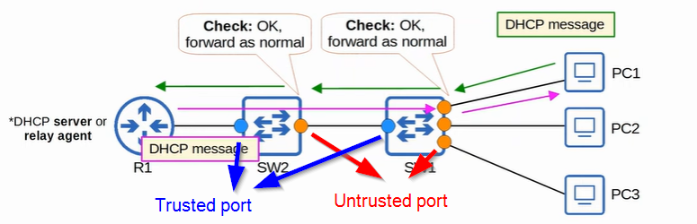
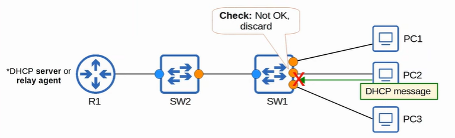

### DHCP Snooping
- used to filter DHCP messages received (only) on untrusted port
- can differentiate messages sent from DHCP Server and DHCP Client
    DHCP Server:
    - OFFER
    - ACK
    - NAK = decline client's REQUEST

    DHCP Client:
    - DISCOVER
    - REQUEST
    - RELEASE
    - DECLINE = declient the address offered by DHCP Server
- how it works:
    1. DHCP Server Message - discard
    2. DHCP Client Message - check
        - DISCOVER/REQUEST - check if source MAC == CHADDR
        - RELEASE/DECLINE - check if source IP and receiving interface == entry in DHCP Snooping Binding table   
- can limit the rate of DHCP messages allowed to enter interface
    - if beyond the configured limit, interface is err-disabled     

 

### DHCP Option 82 / DHCP Relay Agent Information Option
- provide addition information such as
    - which relay agent receive client's messsage
    - which interface
    - which vlan
- when DHCP Snooping enabled, switches (regardless if it is relay agent) will add option 82 to DHCP message they received (default)
- switches will drop DHCP message with Option 82 received on untrusted port (default)

 

### Configuration
- `ip dhcp snooping` + `ip dhcp snooping vlan <vlan id>` - enable dhcp snooping on specified vlan
- `no ip dhcp snooping information option`
- `ip dhcp snooping trust` (**interface config mode**) - change port to trusted port (default: untrusted)
- `show ip dhcp snooping binding`
- `ip dhcp snooping limit rate <packets/sec>` (**interface config mode**) - identify how many packets are allowed to enter the interface per second
`errdisable recovery cause dhcp-rate-limit`