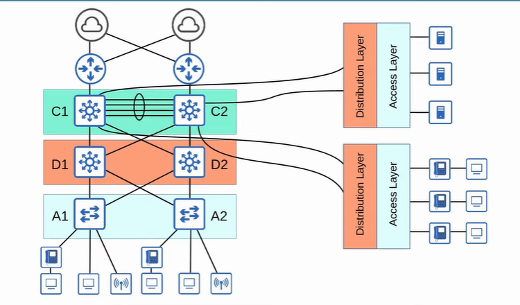

**Star Topology** - several devices connected to one central device

**Full Mesh** - every device is connected to each other

**Partial Mesh** - some device is connected to each other

 

 

### Two-Tier LAN Design / Collapsed Core Design
1. Access Layer
    - connected by end hosts
    - switches at this layer have lots of port for end hosts to connect to
    - QoS / Security services is done here
    - switchport might be PoE-enabled if wireless AP or IP phones is used

2. Distribution Layer / Aggregation Layer
    - aggregates connection from Access Layer Switches
    - border between Layer 2 and 3
    - connect to Internet / WAN services

 

 

### Three-Tier LAN Design
1. Access Layer
2. Destribution Layer / Aggregation Layer
3. Core Layer
    - connect Distribution Layers
    - focus on speed (ie fast transport)
    - should avoid CPU-intensive operations (eg. QoS marking/classification)
    - should maintain connectivity throughout the LAN even device fails

 

 

### Spine Leaf Architechture / Clos Architechture
- (now) for data centers used
- (before) three-tier lan design is used for data center
    - work well for North-South, but not east-west
    - virtual servers and applications deployed in distributed manner
    - east-west traffic increases

         

        

         

- rules:
    1. every leaf switch is connected to every spine switch, vice versa
    2. leaf switches do not connect to each other
    3. spine switches do not connect to each other
    4. end hosts only connect to leaf switches
- path taken is random chosen to load balance among Spine switches
- each server is separated by same number of hops

 

 

### SOHO Networks
- Small Office/Home Office

 

 

