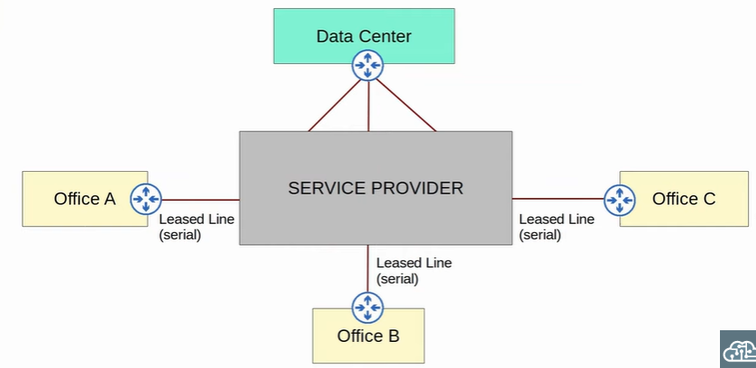
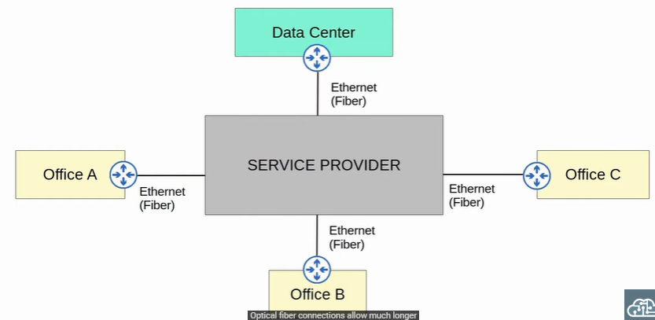
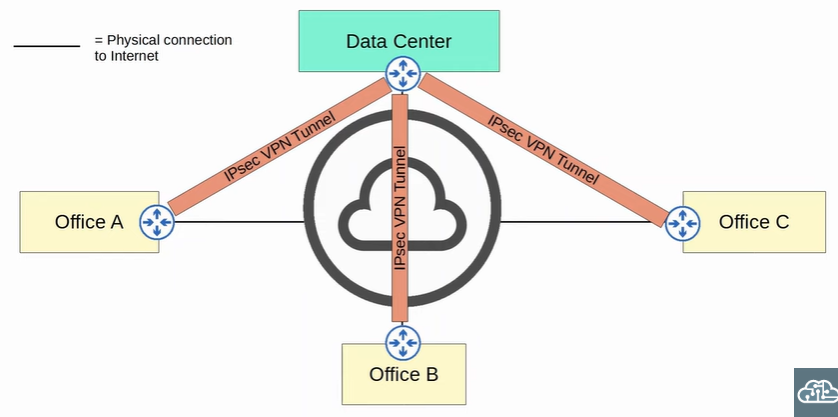
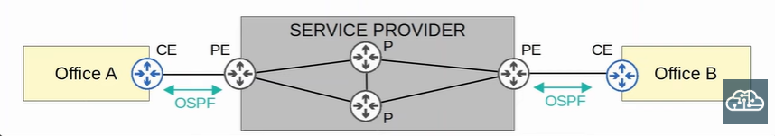
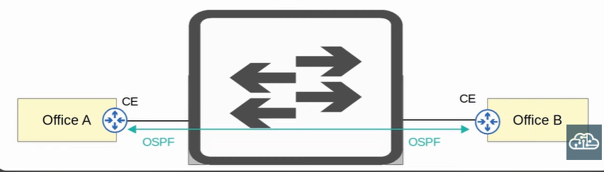
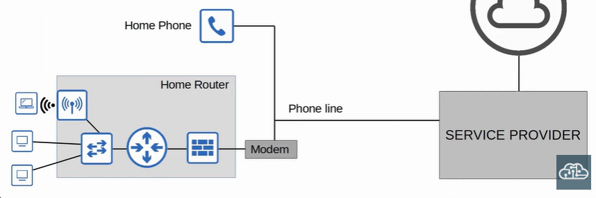
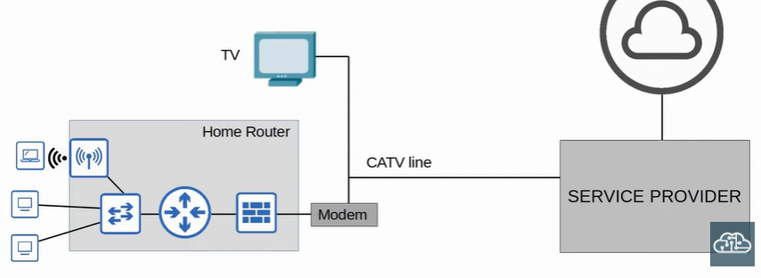
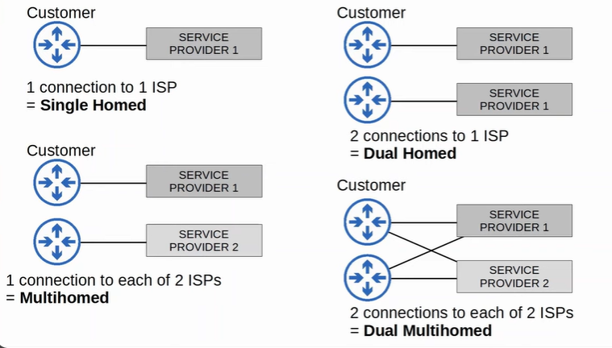
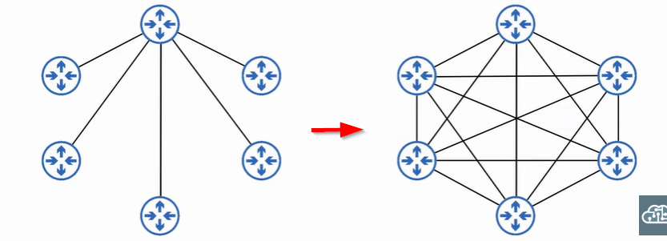
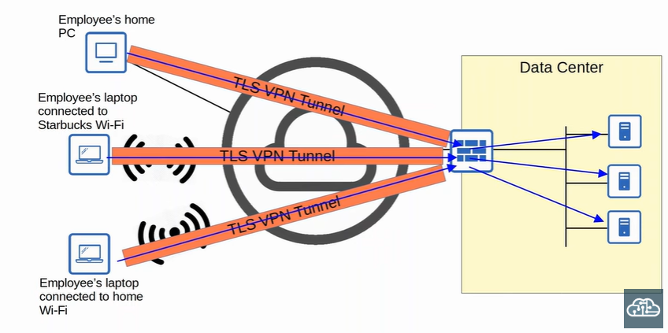

### Wide Area Network (WAN)
- connect geographically separate LANs
- VPN (Virtual Private Network) can be used to create private WAN
- use Hub-and-Spoke topology
    - similar to Star Topology in LAN
    - Hub - central device
    - Spoke - other devices

 

 

 

 

 

### Leased Lines
- dedicated physical link connecting two sites
- use serial connection (PPP / HDLC)
- cons:
    - high cost
    - high installation lead time
    - slow speed

### Multi Protocol Label Switching (MPLS)
- service provider's MPLS network are shared infrastructure (connected by different customer enterprise to make WAN connection)
- label switching allow VPN to be created over MPLS infrastructure by using labels
- these labels differentiate different customer enterprise
- three routers in MPLS infrastructure:
    1. CE router - Customer Edge Router
    2. PE router - Provider Edge Router
    3. P router - Provider Core Router
- PE router add label to the frame received from CE router
    - these labels determine routing decision within the service provider network
- CE router dont use MPLS
- when layer 3 MPLS VPN is used, CE and PE routers peer using OSPF (example) to share routing information
    - CE from each LAN learn about route from each other

     

        

     

- when layer 2 MPLS VPN is used, CE and PE router dont peer
    - two CE routers directly connected
    - WAN interfaces will be in the same subnet
    - two CE routers peer if routing protocol is used

     

    

     

- different technologies (eg Wifi / Ethernet / Serial) can be used to connect to MPLS network

 

 

## Internet Connectivity
### Digital Subscriber Line (DSL)
- provide Internet connectivity over phone lines
- can share the same phone line 
- DSL modem is required to convert data into a format suitable to be sent over the phone lines

 

 

### Cable Internet
- provide Internet connectivity via same CATV (Cable Television) lines used for TV service
- cable modem is required to convert data into format suitable to be send over the CATV cables

 

 

### Redundant Internet Connections
- act as a backup when one of the ISP fails

 

 

 

### Virtual Private Network (VPN)
- provide secure communication over Internet
- two type:
    1. site-to-site VPN using IPsec
    2. remote-access VPN using TLS

### Site-to-site VPN
- VPN tunnel is created betwen two devices
    - combine ori IP packet and session key / encryption key to encrypt the packet
    - encapsulte the IP packet with VPN header and new IP header
    - send the packet through the tunnel
    - de-encapsulate when packet arrive at destination site
- limitations:
    1. only support unicast traffic (can be solved with **GRE over IPsec**)
    2. require hard work to configure full mesh of tunnels between many sites (can be solved with **Cisco's DMVPN**)

### Generic Routing Encapsulation (GRE) over IPsec
- original packet encapsulated with GRE header and new IP header
- whole packet is encrypted
- encrypted packet is encapsulated by IPsec VPN header and new IP header

### Dynamic Multipoint VPN (DMVPN)
- configure IPsec tunnels to a hub site (aka Hub-and-Spoke)
- hub router gives each spoke information about how to form an IPsec tunnel with other spoke

 

 

### Remote-access VPN
- allow end hosts to access the company's internal resources securely over Internet
- use Transport Layer Security (TLS)
- VPN client software is required to be installed on end devices
- secure tunnels is formed to one of the company's routers/firewalls which act as TLS server

