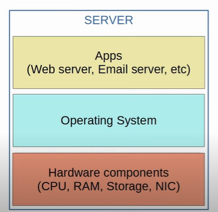
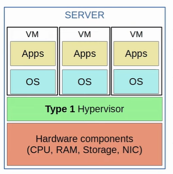
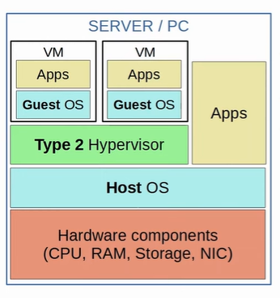
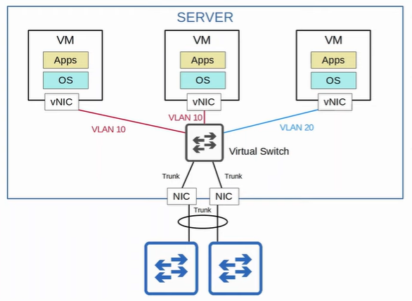
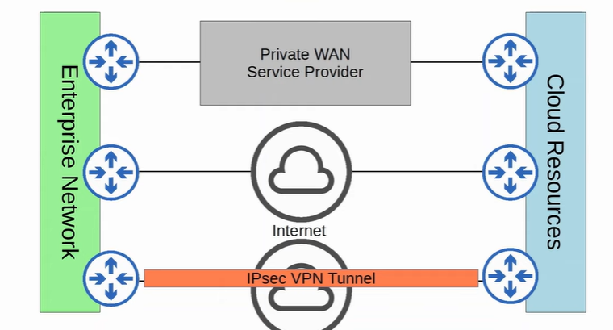
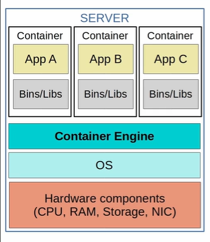

UCS = Unified Computer System

### Servers Before Virtualization
- relationship between physical server and OS = one-to-one
- different servers for different service
    - safer but inefficient
    - each physical server is expensive and takes up space and power

 

 

### Server After Virtualization (Type 1 Hypervisor / Native Hypervisor)
- virtualization enable multiple OS run on physical server
- **hypervisor / VMM (Virtual Machine Monitor)** - manage and allocate hardware resources to each Virtual Machine (VM)
- hypervisor also called bare-metal hypervisor as it run directly on the hardware
- normally used in data center

 

 

### Server After Virtualization (Type 2 Hypervisor / Hosted hypervisor)
- run as program on an OS like a regular computer program
- **Host OS** = OS running directly on the hardware
- **Guest OS** = OS running in a VM
- normally used in personal-use device

 

 

### Connecting VMs to Network
- VMs connect to each other and external network via virtual switch running on hypervisor
- interfaces on virtual switch then connect to physical NIC to communicate with the external network

 

 

### Cloud Service
- Traditional IT Infrastructure
    1. On-Premises
        - all devices and other infrastructure are located on company property
        - company is responsible for necessary space, power and cooling
    2. Colocation
        - data centers that rent out space for customers to put their infrastructure
        - data centers is responsible for space, electricity and cooling
        - but devices are still the responsibility of the end customer

- 5 characteristics:
    1. on-demand self-service
        - customer is able to use the service freely without direct communication to the service provider
    2. broad network access
        - can access the service through standard network connections and many kinds of device
    3. resource pooling
        - pool of resources provided by service provider
        - resources are allocated from the shared pool when customer request for it
    4. rapid elasticity
        - customers can quickly expand their services using the resources from shared pool
    5. measured service
        - cloud service provider measure the customer's usage of cloud resources
        - customer can measure their own use

- 3 service model
    1. Software as a Service (SAAS)
        - customer use the provider's applications running on cloud
        - customer does not control the cloud (eg network / servers)
        - e.g. Microsoft Office 365
    2. Platform as a Service (PAAS)
        - customer is provided platform to create own applications 
        - customer does not control the cloud
        - e.g. Google App Engine
    3. Infrastructure as a Service (IAAS)
        - customer is provided fundamental computing resources to run software or OS
        - customer does not control the cloud but has control over OS, storage, some network components (e.g. firewall) and deployed applications
        - e.g. Google Compute Engine / VM

- 4 Deployment Models
    1. Private Cloud    
        - used by single organization with multiple customers
        - mayb be owned, managed and operated by the organization or third party
        - may be on or off premises
        - service: SAAS, PAAS, IAAS
    2. Community Cloud
        - used by specific community of customers from organization 
        - may be owned, managed and operated by one or more organizations in the community or third party
        - may be on or off premises
    3. Public Cloud
        - open use for general public
        - may be owned, managed and operated by organization
        - may be on or off premises
    3. Hybrid Cloud
        - combination of the previous 3 deployment models

- benefits
    1. Cost - reduced
    2. Global scale - Can scale globally at rapid pace
    3. Speed/Agility - service and resources provide on demand
    4. Productivity - remove time consuming task
    5. Reliability - data can be mirrored at multiple sites to support recovery

 

 

 

### Containers
- software packages that contain an APP and all dependencies (eg bins/libs)
- multiple apps can run in a single container but not recommended
- run on a **Container Engine** (eg Docker Engine) which run on host OS
- lightweight
- **Container Orchestrator** - software platform automating the deployment, management and scaling of the containers (eg Kubernetes)

 

 

### VM vs Container

| VM | Container |
| --- | --- |
| longer boot up time (minutes) | shorter boot up time (milliseconds) |
| require more disk space (gigabytes) | require less disk space (megabytes) |
| require more CPU/RAM | require less CPU/RAM |
| portable (can move between physical systems running the same  hypervisor) | more portable (can run on any container service) |
| more isolated (each VM run its own OS) | less isolated  (all containers run the same OS) | 