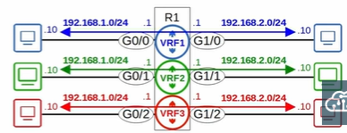

### Virtual Routing & Forwarding (VRF)
- used to divide single router into multiple virtual routers
- only can be configured on routers interfaces / SVI and router ports on switches
- different virtual interface has different routing tables (cannot be shared between VRFs unless using VRF Leaking)
- purposes:
    1. used to facilitate MPLS 
        - **VRF-lite** - VRP without MPLS
    2. allow one device carry traffic from multiple customers
        - each customer is isolated from each other
        - customer IP can overlap

 

 

### VRF Configuration
- `ip vrf <vrf name>`
- `ip vrf forwarding <vrf name>` (**interface config mode**)
- `show ip vrf` - view which vrf interfaces use
- `show ip route vrf <vrf name>` - view routing table of specified vrf'
- `ping vrf <vrf name> <ip>`