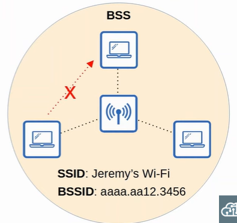
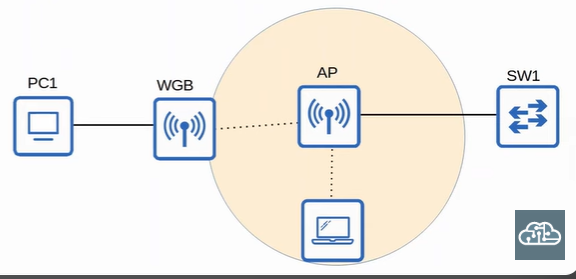

### Wireless Network
- wireless LANs defined in IEEE 802.11
- issues
    1. all devices within the LAN receive all frames so no data privacy
        - CSMA/CA (Carrier Sense Multiple Access with Collision Avoidance) is used
        - same as CSMA/CD but used in wireless network

             

            

             

    2. Wireless communications are regulated by various international and national bodies
        - can't communicate on any channel freely
    3. Wireless signal coverage area must be considered
        - factors affect coverage:
            1. signal range
            2. signal absorption - happens when signal pass through material converted into heat
            3. signal reflection - happens when signal bounces off a material (eg. metal)
            4. signal refraction
            5. signal diffraction - happens when wave encounters obstacles and travel around it
            6. signal scattering - happens when material cause signal to scatter in all directions
    4. Other devices using the same channel can cause interference

 

 

### Radio Frequency
- sender apply AC to an antenna and create electromagnectic field which propagate out as waves
- wave measured in amplitude and frequency (hertz)
- **period** - time taken for one cycle
- wireless LAN use Ultra High Frequency and Super High Frequency

### Radio Frequency Bands
1. 2.4 Ghz
2. 5 Ghz
4. 6 Ghz (only for Wifi 6)

### Channels
- each band is divided up into multiple channels
- devices use one or more channels to transmit and receive traffic
- for 2.4 Ghz, recommended channel: 1,6,11
    - place wireless AP in honeycomb pattern to provide complete coverage without interference between channels

         

        

         

- 5 Ghz contains non-overlapping channels

 

 

### 802.11 Standard
| Standard | Frequencies | Max Data Rate | Alternate Name |
| --- | --- | --- | --- |
| 802.11 | 2.4 | 2Mbps | |
| 802.11b | 2.4 | 11Mbps | |
| 802.11a | 5 | 54Mbps | |
| 802.11g | 2.4 | 54Mbps | |
| 802.11n | 2.4/5 | 600Mbps | Wifi 4 |
| 802.11ac | 5 | 6.93Gbps | Wifi 5 |
| 802.11ax | 2.4/5/6 | 4*802.11ac | Wifi 6 |

 

 

### Service Sets
- groups of wireless network devices
- three types:
    1. Independent
    2. Infrastructure
    3. Mesh
- All devices in a service set share same SSID (service set identifier)
- SSID not necessary to be unique

### Independent Basic Service Set (IBSS) / Ad Hoc network
- independent service set
- two or more wireless devices connected without using AP
- eg. airdrop

 

 

### Basic Service Set (BSS)
- infrastructure service set
- clients connect to each other via AP
- BSSID (Basic Service Set ID) is used to uniquely identify the AP
    - MAC address of AP's radio
    - AP can use the same SSID but not BSSID
- wireless devices are called clients or stations
    - clients must communicate via AP (aka can't directly communicate)
- **BSA (Basic Service Area)** - physical area around AP

 

 

### Extended Service Set (ESS)
- infrastructure service set
- APs connected by wired network
    - each BSS use same SSID
    - each BSS use unique BSSID
    - each BSS use different channel
- **roaming** - client pass between APs without reconnecting
- BSAs should overlap about 10-15% to avoid losing connection

 

 

### Mesh Basic Service Set (MBSS)
- used when it is difficult to run Ethernet connection to every AP
- two radios used:
    1. provide BSS to wireless clients
    2. **backhaul network** - bridge traffic from AP to AP
- at least one **RAP (Root Access Point)** connected to the wired network
- other APs are called **MAP (Mesh Access Point)**
- protocol is used to determine the best path through the mesh 

 

 

 

### Distribution System (DS)
- upstream wired network 
- wireless BSS and ESS mapped to VLAN in wired network
- an AP can be used for multiple WLAN, each with unqiue SSID
    - each WLAN is mapped to separate VLAN and conencted to wired network via trunk
    - each WLAN use unique BSSID

 

 

 

 

### Additional AP Operational Modes
1. Repeater
    - extend the range of BSS
    - retransmit the signal received from AP
        - **repeater with single radio** must operate on same channel as the AP, but thiw will reduce the throughput on the channel
        - **repeater with two radios** - receive on one channel and retransmit on another channel

         

        

         

2. Workgroup Bridge
    - allow devices that don't support wireless connection to connect to the Wifi
    - two kind:
        1. WGB - only for cisco
        2. universal WGB (uWGB) - 802.11 standard

         

        

         

3. Outdoor bridge
    - used to connect network over long distance without physical cable
    - APs usee specialized antennas that focus most of the signal power in one direction

         

        

         

        

**Wifi-Alliance test and certifies equipment for 802.11 standards**