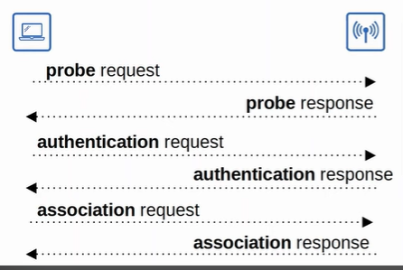
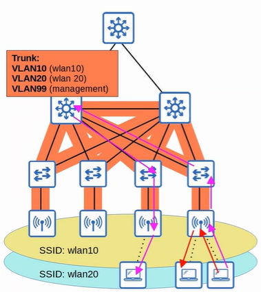
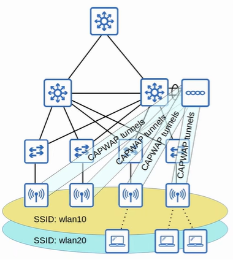
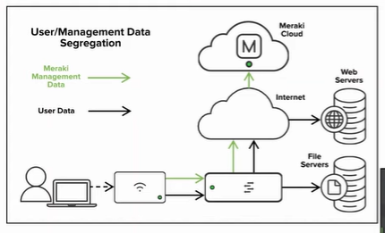
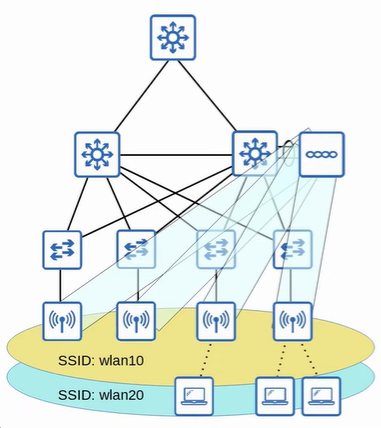
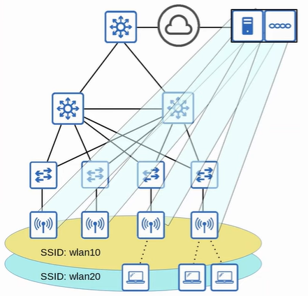
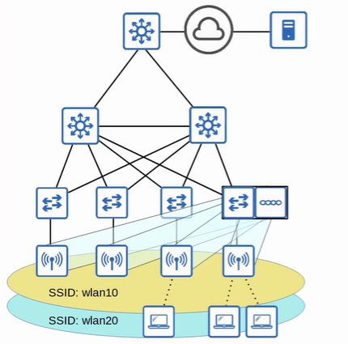
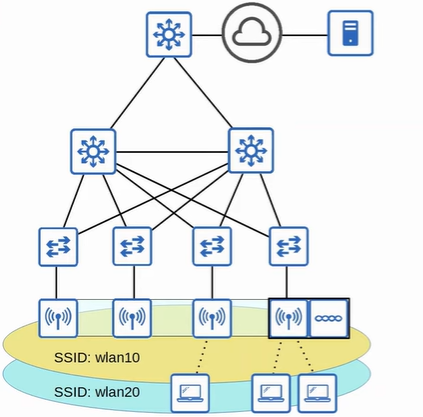

### 802.11 Frame Format
```
------------------------------------------------------------------------------------------------------------------------------------
| Frame Control | Duration/ID | Addr 1 | Addr 2 | Addr 3 | Sequence Control | Addr 4 | QoS Control | HT Control | Frame Body | FCS |
------------------------------------------------------------------------------------------------------------------------------------

!!! Not all 4 address will be used
```
1. Frame Control
    - indicate message type and subtype
2. Duration/ID
    - indicate time (microsec) the channel will be dedicated for frame transmission
    - indicate identifier for the connection
3. Address
    - destination address (DA): final recipient
    - source address (SA): ori sender
    - receiver address (RA): immediate recipient
    - transmitter address (TA): immediate sender
4. Sequence Control
    - reassemble fragment and eliminate duplicate frame
5. HT (High Throughput) control
    - enable HT operations
    - 802.11n: HT wifi
    - 802.11ac: Very HT wifi
6. Frame Check Sequence

<br>
<hr>
<br>

### 802.11 Association Process
- 3 Connection State
    1. Not Authenticated and Not Associated
    2. Authenticated and Not Associated
    3. Authenticated and Associated
- two way a client can scan for BSS:
    1. active scanning
        - client send probe request
        - AP send probe response back
    2. passive scanning
        - client listen for beacon message sent by AP periodically

 

### 802.11 Message Type 
1. Management - used to manage BSS
    - beacon
    - probe request/response
    - authentication request/response
    - association request/response

2. Control - used to control access to radio frequency/medium
    - RTS (Request to Send)
    - CTS (Clear to Send)
    - ACK

3. Data - used to send actual data packets

<br>
<hr>
<br>

### AP Deployment Methods
1. Autonomous
    - self-contained system that don't rely on Wireless LAN Controller (WLC)
    - configured by console cable, telnet/SSH or HTTP/HTTPS web connection
    - Radio Frequency parameter must manually configured (eg transmit power / channel)
    - Security policies handled individually by each AP
    - QoS rules configgured individually on each AP
    - suitable for small network

    <hr>

    - connect to the wired network with trunk link
    - clients connected to the same AP only need to send traffic through AP
    - but devices from different VLAN has to send traffic across the entire network
        - large broadcast domains
        - spanning tree will disable links
        - adding/deleting VLAns require lots of work
    - autonomous AP can function in alternative modes

        <br>

        

        <br>

2. Lightweight
    - AP functions can be split between APs and Wireless LAN Controller (WLC)
    - lightweight APs handle real-time operations
        - transmit/receive RF traffic
        - encrypt/decrypt traffic
        - send out beacons/probes
    - WLC handle function like:
        - RF management
        - security/QoS management
        - client management
        - client association / roaming management
        - centrally configure lightweight APs
    - split-MAC architechture
    - WLC can locate in same or different subnet/VLAN as the lightweight APs it manages
    - WLC and lightweight APs authenticate each other using digital certificates (follow X.509 standard)

    <hr>

    - WLC and lightweight APs use CAPWAP protocol (Control and Provisioning of Wireless Access Point) to communicate
    - (Old Protocol): LWAPP (Lightweight Access Point Protocol)
    - two tunnels created between WLC and APs
        1. Control Tunnel (UDP 5246)
            - configure AP and manage operations
            - traffic encrypted (default)
        2. Data Tunnel (UDP 5247)
            - transmit traffic from wireless clients to WLC
            - traffic not go directly to wired network
            - traffic not encrypted (default but can configured)
    - AP connect to switch access port (not trunk)

        <br>

        

        <br>

    <hr>

    - lightweight APs can operate in modes:
        1. Local (default)
            - AP offer BSS for clients to associate with
        2. FlexConnect
            - same as local but it allow AP to switch traffic between wired and wireless network if tunnel to WLC go down
        3. Sniffer
            - does not offer BSS for client
            - capture 802.11 frames and send to device running software like WireShark
        3. Monitor
            - does not offer BSS for client
            - receive 802.11 frames to detect rogue devices
            - send de-authentication messsage if found rogue device
        4. Rogue Detector
            - not using its radio
            - listen to traffic on wired network only
            - receive list of suspended rogue clients and AP MAC address from WLC to detect rogue device
        5. SE-Connect (Specturm Expert Connect)
            - does not offer BSS for client
            - send information liek Cisco Specturm Expert on PC to collect and analyse the data
        6. bridge/mesh
            - can be dedicated bridge between sites
            - mesh can be made between APs
        7. flex-plus bridge
            - add FlexConnect functionality to bridge/mesh mode

3. Cloud-based
    - in between autonomous AP and split-MAC architechture
    - example: Cisco Meraki
        - dashboard used to configure APs / monitor network / generate performance reports
        - tell each AP which channel / what transmit power to use
    - only management/control traffic is sent to the cloud
    - data traffic is sent to the wired network

        <br>

        

        <br>

<hr>
<br>

### WLC Deployment Methods
1. Unified - WLC is hardware in central location
    - can support up to 6000 APs
    - additional WLCs can be added if APs more than that

        <br>

        

        <br>

2. Cloud-based - WLC is VM running on server (usually private cloud in data center)
    - can support up to 3000 APs
    - additional WLC VMs can be added if APs more than that

        <br>

        

        <br>

3. Embedded - WLC is integrated within a switch
    - can support up to 200 APs
    - more switches embedded WLCs can be added if APs more than that

        <br>

        

        <br>

4. Mobility Express - WLC is integrated within an AP
    - can support up to 100 APs
    - more APs with embedded Mobility Express WLCs can be added if APs more than that

        <br>

        

        <br>