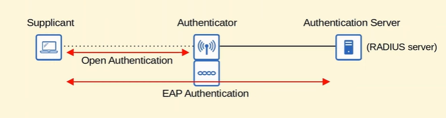
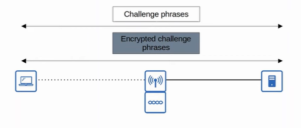
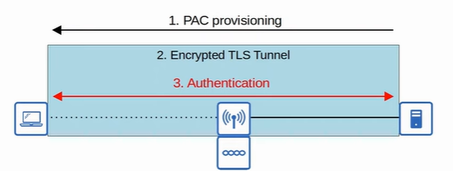
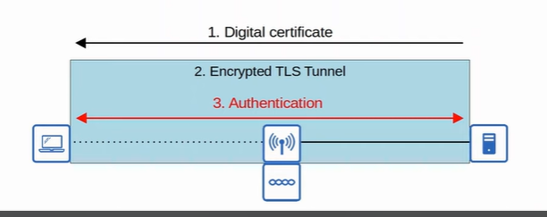

### Authentication
- clients must authenticated before they connect to AP
- in corporate settings, separate SSID can be provided for guest users
- client should also authenticate the AP to avoid connecting with malicious AP
- ways to authenticate:
    - password
    - username/password
    - certificates

### Encryption
- client has a unique encryption/decryption key 
- **group key** - key used by AP to encrypt traffic it want to send to its clients
    - clients should keep the key to decrypt the traffic

### Integrity
- MIC (Message Integrity Check) is used
    1. sender calculates MIC and attach to the message
    2. sender encrypt the message
    3. recipient decrypt the message
    4. recipient independently calculate MIC for the message using same protocol
    5. if MIC don't match, discard the message

 

 

### Authentication Method
1. Open Authentication
    - client send authentication request and AP accept it
    - not secure
    - client then required to authenticate via other methods before network is granted
    - eg: Starbuck's Wifi

2. WEP (Wired Equivalent Privacy)
    - used to provde both authentication and encryption
    - encryption use RC4 algo
    - shared-key protocol
        - sender and receiver required to have the same key
        - can be 40/104 bits
        - key then combined with 24 bit IV (Initialization Vector)
    - not secure as easy to crack
    - process:
        1. AP send challenge phrase
        2. Client encrypt challenge phrase using WEP key and send it back
        3. AP compare its encrypted challenge phrase with the one sent by receiver 

3. EAP (Extensible Authentication Protocol)
    - authentication framework whcih define standard set of authentication function that used by various EAP methods
    - integrated with 802.1X, which provide port-based network access control
        - limit network access for clients to connect LAN or WLAN until they authenticate
        - **supplicant** - device that want to connect the network
        - **authenticator** - device that provide access to the network
        - **autentication server (AS)** - receive client credentials and permits/denies access

             

            

             

4. LEAP (Lightweight EAP)
    - developed by Cisco
    - client must provide username and password 
    - both client and server send challenge phrases to each other (bidirectional of WEP)
    - dynamic WEP keys (ie WEP keys that changed frequently) are used
    - should not be used anymore 

         

        

         

5. EAP-FAST (EAP Flexible Authentication via Secure Tunneling)
    - developed by Cisco
    - three phrases:
        1. PAC (Protected Access Credential) generated and passed from server to client
        2. Secure TLS tunnel established
        3. Inside the tunnel, client and server communicate to authenticate/authorize the client 

             

            

             

6. PEAP (Protected EAP)
    - same as EAP-FAST
    - instead of PAC, server send digital certificate which also used to establish TLS Tunnel
    - MS-CHAP (Microsoft Challenge-Handshake Authentication Protocol) is used to keep client authenticated

         

        

         

7. EAP-TLS (EAP Transport Layer Security)
    - same as PEAP
    - both client and server required a digital certificate
    - no need to authenticate the client within the TLS tunnel due to certificate on client side
    - TLS tunnel is still established to exchange encryption key information
    - hard to implement

 

 

### Encryption Method
1. TKIP (Temporal Key Integrity Protocol)
    - need a immediate solution after realised WEP is vulnerable
    - used in WPA1 
    - add some security features
        1. MIC is added
        2. Key Mixing Algorithm is used to create unique WEP key for each frame
        3. Initialization Vector is doubled
        4. MIC include sender MAC address 
        5. Timestamp is added to prevent replay attack (ie. re-resending a frame that has already been transmitted)
        6. TKIP Sequence Number is used to prevent replay attacks

2. CCMP (Counter/CBC-MAC Protocol)
    - used in WPA2
    - need supported by device
    - consists of 2 algorithms to provide encryption and MIC
        1. AES (Advanced Encryption Standard) counter mode encryption
        2. CBC-MAC (Cipher Block Chaining Message Authentication Code) is used as MIC

3. GCMP (Galois/Counter Mode Protocol)
    - used in WPA3
    - consists of 2 algorithms
        1. AES counter mode encryption
        2. (Galois Message Authentication Code) is used as MIC

 

 

### Wifi Protected Access (WPA)
- support two authentication modes:
    1. Personal Mode
        - pre-shared key (PSK) is used for authentication
        - required password when connect to the network
        - Four-way handshake is used for authentication and PSK is used to generate encryption keys
    2. Enterprise Mode
        - use 802.1X
- WPA3 has additional security feature:
    1. PMF (Protected Management Frames)
        - protect 802.11 management frames fromm eavesdropping
    2. SAE (Simultaneous Authentication of Equals)
        - protect four-way handshake 
    3. Forward secrecy
        - prevent data from decrypted after it has been transmittted over the air
        - attacker cannot capture wireless frame and decrypt it
