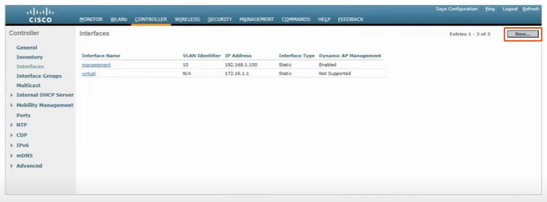
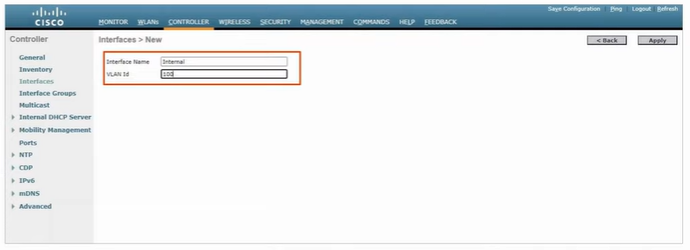
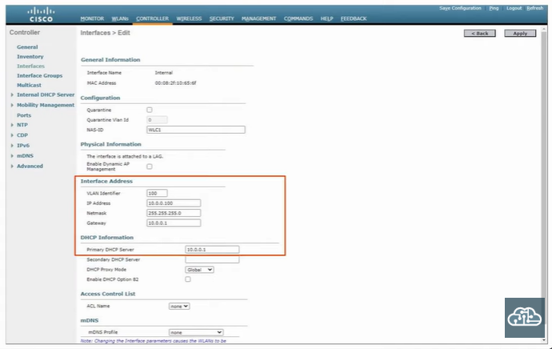
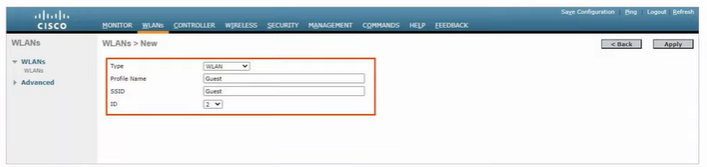
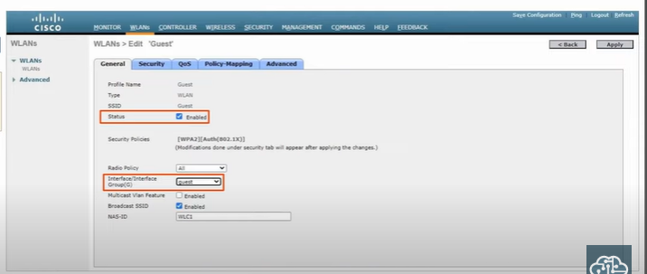
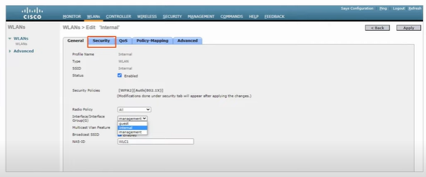
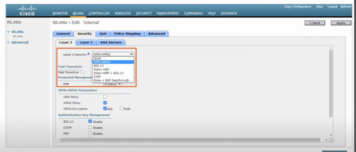
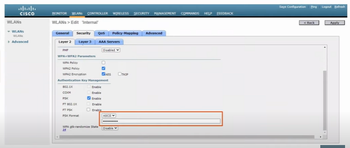
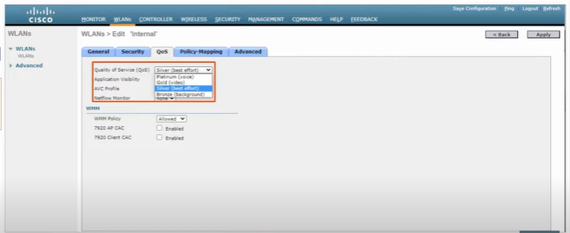

**WLC only support static LAG, not PAgP or LACP**

### Switch Configuration
1. create vlan 
2. assign ip for vlan create
3. configure switchport to access mode and include vlan
4. create etherchannel between switch to WLC
5. configure etherchannel created as trunk port
(dhcp configuration)
6. create dhcp pool for each vlan
    - `option 43 ip <WLC's ip>`
        - option 43 tells AP the IP address of their WLC
        - only needed when AP in this vlan can't broadcast CAPWAP discovery message message to WLC to learn its ip
(ntp configuration)
7. configure as ntp master

### WLC Port/Interface
- **port** - physical ports that cable connect to
- **interface** - like SVIs on the switch
- port types:
    1. Service port
        - used for out-of-band management
        - must connect to switch access port as it only support one VLAN
    2. Distribution System port
        - connect to wired network that used for data traffic
        - connect to switch trunk port
        - can form LAG
    3. Console Port
        - RJ45
        - USB
    4. Redundancy Port
        - used to connect to another WLC to form high availability (HA) pair
- interfaces types:
    1. Management Interface
        - used for management traffic (SSH, HTTPs, RADIUS authentication etc)
        - CAPWAP tunnels also formed using this interface
    2. Redundancy Management Interface
        - when two WLC connected by redundancy ports, one active one standby
        - this interface used to connect and manage the standby one
    3. Virtual Interface
        - used when communicating with wireless clients to relay DHCP requests
        - perform client web authentication
    4. Service Port Interface
        - used for out-of-band management
    5. Dynamic Interface
        - used to map WLAN to VLAN

### WLC Configuration (Controller)

 

 

 

### WLC Configuration (WLAN)

