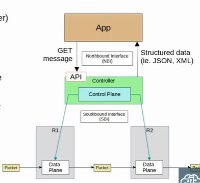

### Logical Planes
Different function of network devices can be categorized into:
1. Data Plane / Forwarding Plane
    - forwarding data/traffic
    - managed by ASIC (Application-Specific Integrated Circuit) for better processing speed
2. Control Plane
    - control what data planes does
    - function that build tables (routing/MAC/ARP etc)
    - managed by CPU
    - tabls are stored in TCAM (Ternary Content-Addressable Memory)
3. Management Plane
    - perform overhead work
    - consist of protocols
    - managed by CPU

### Software-Defined Networking (SDN) / Software-Defined Architecture (SDA) / Controller-Based Networking
- network that centralizes the control plane into application called controller
- controller can interact programmatically with network devices using APIs
- communication between controller and devices via Southbound Interface (SBI)

### Southbound Interface (SBI)
- consist of communication protocol and API
- API allow controller to access information on the devices, control data plane tables etc
- Example:
    - OpenFlow
    - Cisco OpFlex
    - Cisco onePK (Open Network Environment Platform Kit)
    - NETCONF

### Northbound Interface (NBI)
- allow to interact with the controller
    - access data gathered
    - make changes in the network 
- REST API is used on controller as interface for apps to interact with it
    - Data sent in JSON or XML

 

 
