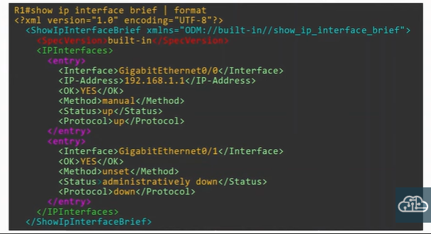
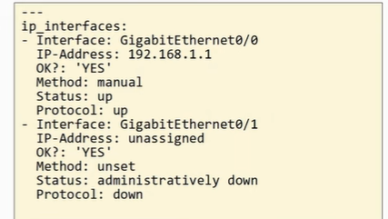

### Data Serialization
- converting data into standardized format that can be stored in a file or transmitted over a network
- data can be reconstructed 
- communication between application

### JSON (Javascript Object Notation)
- open standard file format and data interchange format
- primitive data type:
    - string
    - number
    - boolean
    - null
- structured data type
    - object
    - array

### XML (Extensible Markup Language)
- <key>value</key>

 

 

### YAML (Yet Another Markup Language)
- used by network automation tool - Ansible
- whitespace and indentation matters
- start with "---"
- "-" used to indicate list
- key:value

 

 