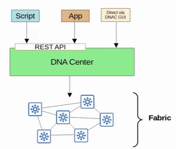
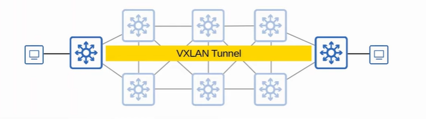
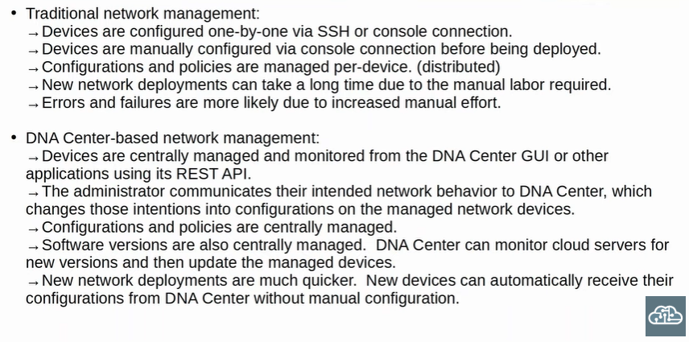

### Software-Defined Networking (SDN)
- App: Application Layer - contain script that tell the SDN controller what network behviors are desired
- Controller: Control Layer - receive and process instructions from application layer
- Data Plane: Infrastructure Layer-  contain network devices that forward messages across the network

### SD-Access
- Cisco SDN solution
    - ACI (Application Centric Infrastructure) is SDN solution for automating data center networks
    - SD-WAN is SDN solution for automating WANs
- Cisco DNA (Digital Network Architechture) Center is controller 
    - enable Intent-Based Networking (IBN)
        - allow engineer to communicate their intent for network behaviour to DNA center
        - DNA center take care of the details of the actual configurations and policies on devices

 

 

- **underlay**: underlying physical network of devices and connections which provide IP connectivity
    - 3 roles for switches:
        1. Edge Nodes - connect to end hosts
        2. Border Nodes - connect to devices outside of SD-Access domain (ie WAN routers)
        3. Control Nodes - use LISP (Locator ID Separation Protocol) to perform various control plane functions
    - **brownfield deployment** - add SD-Access on top of an existing network
        - DNA Center won't configure the underlay
    - **greenfield deployment** - new deployment
        - DNA Center will configure the underlay
        - all switches are Layer 3 and use IS-IS
        - all links between switches are routed port (no STP used)
        - Edge nodes act as default gateway of end hosts

             

            

             

- **overlay**: virtual network built on top of the physical underlay network
    - LISP provide control plane of SD-Access
        - list of mappis of EIDs (endpoint identifiers) to RLOCs (routing locators)
        - EIDs identify end hosts connected to edge switches
        - RLOCs identify edge switch can be used to reach the end hosts
    - Cisco TrustSec (CTS) provide policy control (Qos, Security policy...)
    - VXLAN (Virtual Extensible LAN) provide data plane of SD-Access
- **fabric**: underlay + overlay

 

 

 

