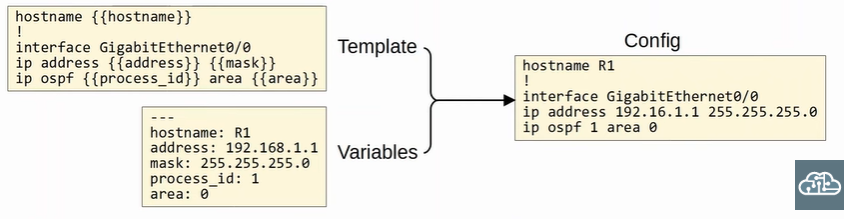
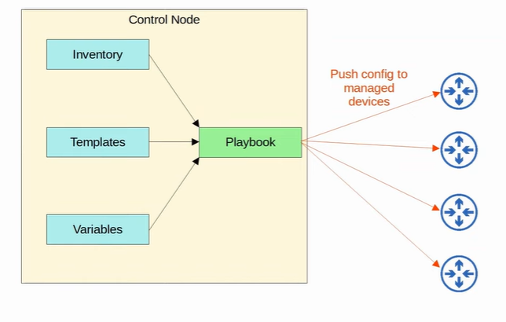
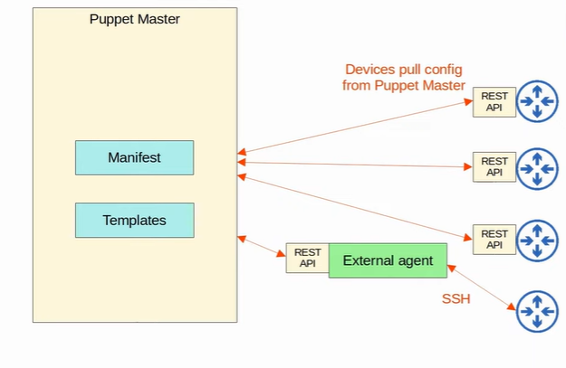
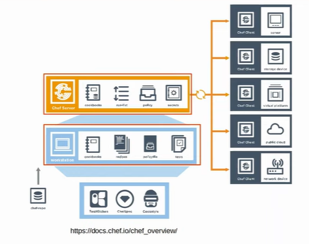
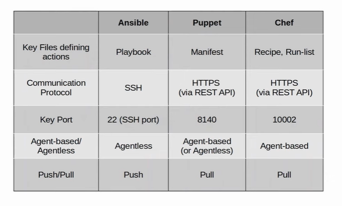

### Configuration Drift (SHOULD BE SOLVED!!!)
- when individual changes made over time cause device's configuration to deviate from the standard configuration

### Configuration Provisioning
- how configuration changes are applied to devices
- 2 components:
    - templates 
    - variables

 

 

 

### Configuration Management Tools
- Example: Ansible, Puppet and Chef
- functionality:
    - generate configurations for new devices on a large scale
    - perform configuration changes on devices
    - check device configurations for compliance with defined standards
    - compare configurations between devices / different configuration version on same device

### Ansible
- written in Python
- agentless: does not require special software to run
- use SSH to connect to devices
- Ansible server = Control node
- use push model
    - use SSH to connect to managed device
    - push configuration changes to them
- required text files:
    1. playbooks
        - blueprints of automation tasks
        - outline the logic and actions of the tasks that should do
        - written in YAML
    2. Inventory
        - list the devices that will be managed
        - list the characteristics of each device (eg device role)
        - written in INI, YAML or other formats
    3. Templates
        - device's congifuration files but specific values for variables are not provided
        - written in Jinjia2 format
    4. Variables
        - lists variables and their values
        - written in YAML

 

 

### Puppet
- written in Ruby
- not all Cisco devices support
- agent-based
- can run agentless where proxy agent runs on an external host and the proxy agent use SSH to connect 
- Puppet server = Puppet master
- use pull model (aka client pull configurations from Puppet master)
    - client use TCP 8140
- required text files:
    1. Manifest
        - define the desired configuration state of network devices
    2. Templates
        - same as Ansible Templates
        - generate manifests 

 

 

### Chef
- written in Ruby
- not all Cisco devices support
- agent-based
- use pull model
- server use TCP 10002 to send configurations to clients
- files use DSL (Domain-Specific Language) based on Ruby
- required text files:
    1. Resources
        - ingredients in a recipe
        - configuration objects managed by Chef
    2. Recipes
        - outline the logic and actions of tasks performed on the resources
    3. Cookbooks
        - set of related recipes grouped together
    4. Run-list
        - ordered-list of recipes that are run to bring a device to the desired configruation state

 

 

 