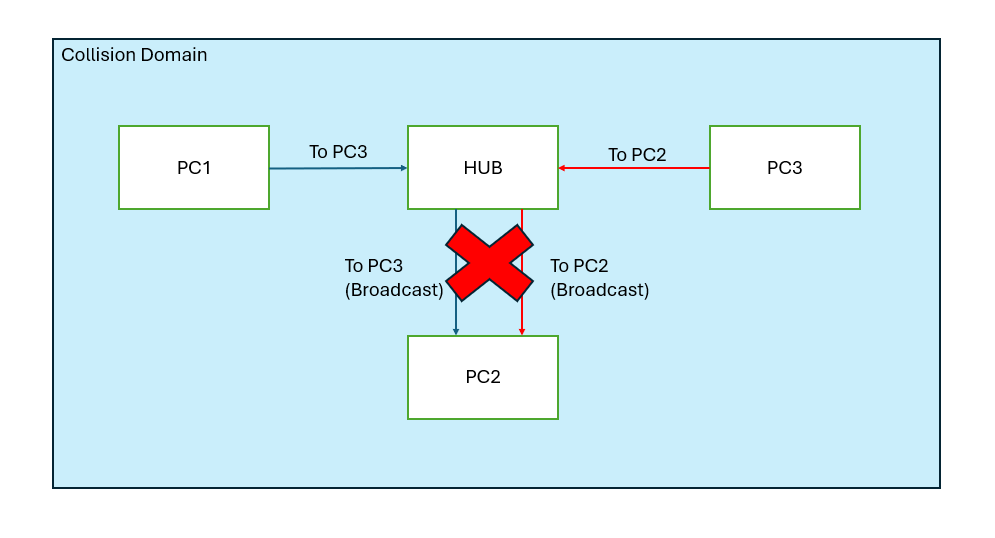
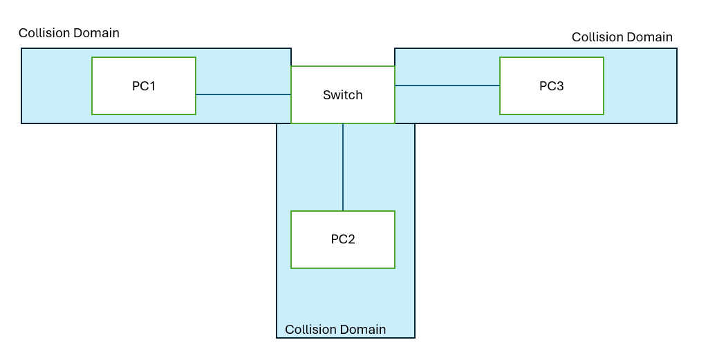

### Configuring IP Addresses (Switch)
- `show ip interface brief` - same as router 
    - either up/up or down/down
    - no administratively down as there is no `shutdown` command for switch interfaces

- `show interfaces status`
    - port
    - name
    - status 
    - vlan
    - duplex - indicate whether it could trasmit and receive at the same time
    - speed
    - type - connector type (e.g. 10/100BASE-T)

- `speed <speed value>` - assign speed of an interface (default a-(speed val))

- `duplex <duplex type>` - assign duplex type/value of an interface (default a-full)

- `interface range <interface range>`
    - configure specified interface all in one shot
    - used to disable all the interfaces not in-used (default enable)
    - e.g. `interface range f0/5 - 6, f0/9 - 12`

 

 

### Full/Half Duplex
**Half Duplex**
- cannot send and receive data at the same time
- used in hub (legacy)

**Full Duplex**
- can send and receive data at the same time

### Collision Domain

**Resolve Collision (Half Duplex): Carrier Sense Multiple Access with Collision Detection (CSMA/CD)**
1. device listen to the colliison domain until other devices are not sending (before sending frames)
2. if collision occurs, device send jamming signal to other devices telling them collision happened
3. Each device will wait a random period of time before sending frames again
4. Repeat step 1 - 3

 

 

### Speed/Duplex Autonegotiation
- switch auto-assign speed and duplex to best speed and duplex the connected device are capable of
- if other device's autonegotiation is disabled:
    - speed:
        - switch sense the spped of other device operating at
        - if fails then use the **lowest** speed (e.g. 10 Mbps on 10/100/1000 interface)
    - duplex:
        - half duplex if 10 / 100 Mbps (even if the duplex at other device is full, it will assign it to half)
        - full duple if 1000 Mbps

 

 

### Interface Error
- view from command `show interfaces <interface id>`
    - **runts** - frames that are < min frame size (64 bytes)
    - **giants** - frames that are > max frame-size (1518 bytes)
    - **CRC** - frames that failed CRC check
    - **Frame** - frames that have incorrect format
    - **Input Errors** - sum of errors (above four)
    - **Output Errors** - frames the switch tried to send but failed