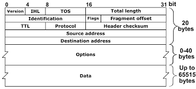

1. **Version**
- 4 bits
- 0100 (IPv4)
- 0110 (IPv6)

2. **Internet Header Length (IHL) [OPT]**
- 4 bits
- indicates header total length
- total length = 4 * val
- 0101 (5) <= val <= 1111 (15)
- 20 <= total length <= 60

3. **Differentiated Services Code Point (DSCP)**
- 6 bits
- Used for Quality of Service (QOS)
- identify which traffic receive priority treatment (e.g. delay-sensitive data: streaming voice / video)

4. **Explicit Congestion Notification (ECN) [OPT]**
- 2 bits
- provide end-to-end notification of network congestion without dropping packets
- require both endpoints and the network structure to support

5. **Total Length**
- 16 bits
- indicates total length of packet PDU
- 00000000 00010100 (20) <= val <= 11111111 11111111 (65535)

6. **Identification**
- 16 bits
- if packet is larger than Maximum Trasmission Unit (MTU) - 1500 bytes
- it will break into few fragments which all has the same value in this field
- then reassembled by receiving host

7. **Flags**
- 3 bits
- first bit: reserved - always 0
- second bit: Don't Fragement (DF bit)
    - 1: packet should not be fragmented
    - 0: packet could be fragmented
- third bit: More Fragment (MF bit)
    - 1: there are more fragments
    - 0: last fragment / DF bit is 1

8. **Fragment Offset**
- 13 bits
- indicate the position of fragment in the ori packet
- so that receiving host could reassemble if the fragments arrive out of order

9. **Time To Live (TTL)**
- 8 bits
- each time packet arrives at a router, value -= 1 (initial: 64 / 255)
- prevent infinite loop
- drop the packet when val == 0 

10. **Protocol (Layer 4)**
- 8 bits
- 00000110 (6): TCP
- 00010001 (17): UDP
- 00000001 (1): ICMP
- 01011001 (89): OSPF (dynamic routing protocol)

11. **Header Checksum**
- 16 bits
- when router receives packet, it calculate the checksum of header
- if calculated checksum != checksum val, error occurs during transimission, so dop the packet 
- **only check for error in IPv4 Header, not the encapsulated data (this could be check from TCP/UDP protocol checksum)**

12. **Source / Destination IP Addr**
- 32 bits

13. **Options [OPT]**
- 0 - 320 bits
