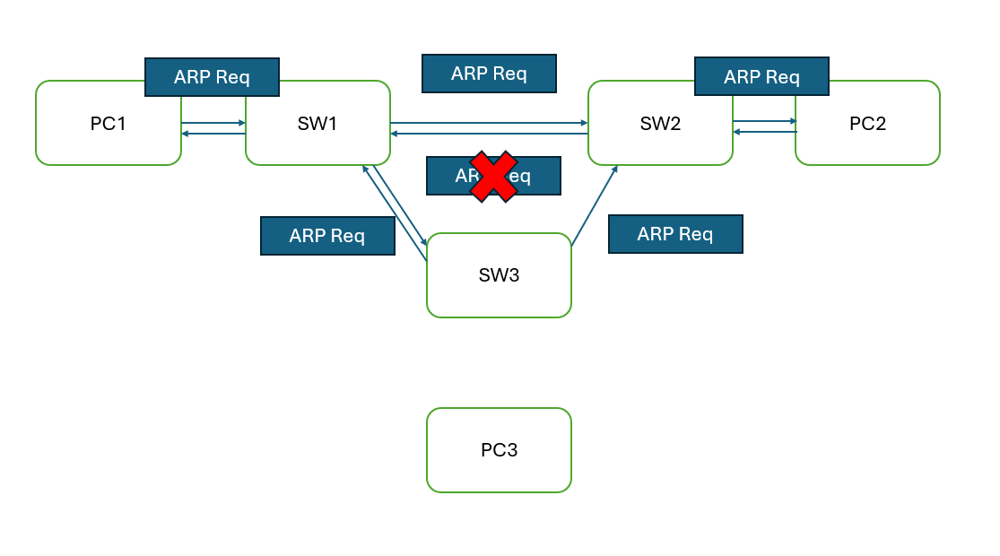

### Routing
- routers determine the path that packets should take to reach their destination
- routers store routes in routing table
- find the best route to forward the packet upon receiving it
    1. network of destination ip == network addr (C - connected) in routing table -> **match**
    2. destination ip == ip addr configured (L - Local) in routing table -> **exact match**
    3. network of destination ip != network addr (C - connected) in routing table -> **no match**

- two routing method:
    - static routing: network admin manually configure routes
    - dynamic routing: routers use OSPF to share routing info with each other and build routing table 

### Default Gateway
- default route to send the packet
- 0.0.0.0/0 means all the ip addresses available
- so it won't drop the packet if network / ip is not found at a router
- send the packet to the Internet

### Command
- `show ip route` - show routing table
    - L - local: route to the **exact** ip addr configured on the interface (/32 netmask regardless of the actual netmask)
    - C - connected: route to the **network** the interface is conencted to (actual netmask)
    - after `no shutdown`, these 2 routes will be added to the routing table

 

 

### Static Routing

- routers do not need to know all the network
- just knows what is the next hop to reach the destination
- always ensure two-way reachability
- Command:
    - `ip route <interface ip> <subnet mask> <next-hop ip>` - assign next hop ip address
        - [1/0] = [Administrative Distance / Metric]
    - `ip route <interface ip> <subnet mask> <exit interface>` - assign interface to send the packet out
        - using Proxy ARP to find the next hop [Not Important for now!!!]
    - `ip route <interface ip> <subnet mask> <exit-interface> <next-hop ip>`- combining previous two commands

**if multiple valid route has the same destination IP address, the most specific route will be chosen (aka longest prefix length)**

**if non of the route match the destination IP address, it will drop the packet**

**Static routes in which you specify only the exit-interface appear as directly-connected in the routing table.**

**direct, dedicated connection between two routers is called point-to-point network**